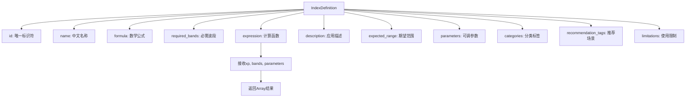
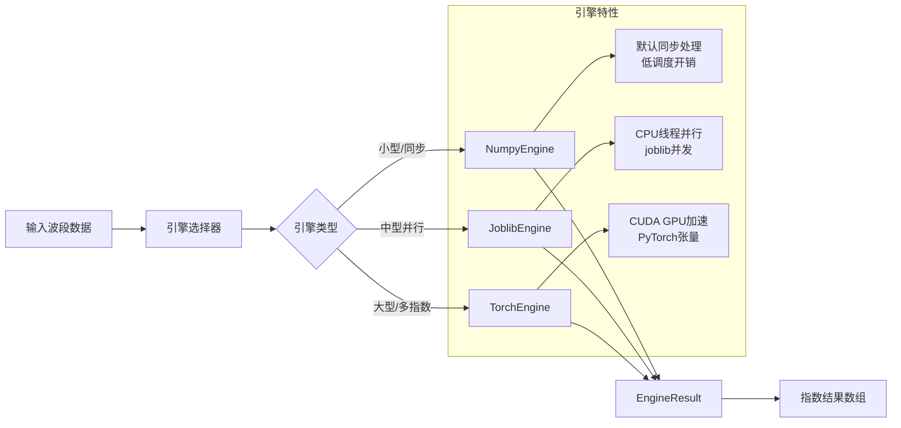
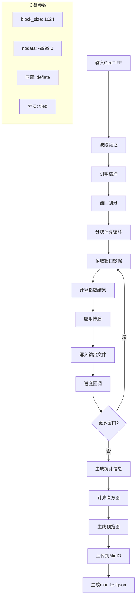
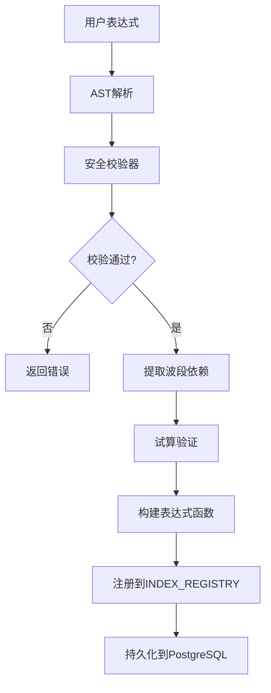
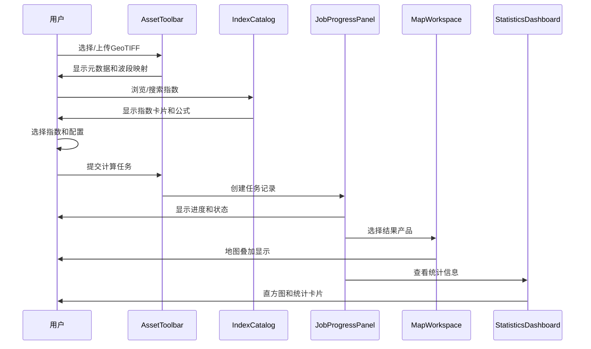

本页面深入解析植被指数智能分析平台的核心计算机制。平台提供30种内置植被指数和动态自定义指数支持，通过多引擎计算架构和栅格分块流水线，实现从公式定义到GeoTIFF输出的完整处理链。

## 指数注册表与定义体系

平台采用**统一注册表模式**管理所有植被指数。核心定义位于`backend/app/core/indices.py`，每个指数通过`IndexDefinition`数据类封装公式、元数据和计算逻辑。



**关键设计原则**：公式函数只依赖传入的数组后端`xp`，因此同一份定义可以由NumPy或PyTorch执行。所有除法统一经过`safe_divide`函数，避免无穷值污染结果。

Sources: [backend/app/core/indices.py](backend/app/core/indices.py#L1-L63)

## 内置指数分类

平台内置30种植被指数，涵盖植被覆盖、叶绿素、水分胁迫、土壤调节等多个应用领域：

| 分类 | 指数示例 | 应用场景 | 典型公式 |
|------|----------|----------|----------|
| **植被覆盖** | NDVI, GNDVI, RVI, DVI | 植被长势评估、变化监测 | (NIR-Red)/(NIR+Red) |
| **叶绿素监测** | NDRE, GCI, RECI, MTCI | 氮素状态、作物胁迫 | (NIR-RedEdge)/(NIR+RedEdge) |
| **土壤调节** | SAVI, OSAVI, MSAVI | 稀疏植被、裸土背景 | (1+L)*(NIR-Red)/(NIR+Red+L) |
| **大气校正** | EVI, ARVI, VARI | 高生物量区域、大气影响 | G*(NIR-Red)/(NIR+C1*Red-C2*Blue+L) |
| **水分胁迫** | NDMI, NDWI, MSI | 干旱监测、水分胁迫 | (NIR-SWIR1)/(NIR+SWIR1) |
| **可见光** | GLI, NGRDI, ExG | 无人机RGB、冠层绿度 | (2*Green-Red-Blue)/(2*Green+Red+Blue) |
| **扰动监测** | NBR, BSI | 火烧迹地、裸土识别 | (NIR-SWIR2)/(NIR+SWIR2) |

平台确保注册表始终包含30种指数，并在启动时验证：

```python
CORE_INDEX_COUNT = len(INDEX_DEFINITIONS)
if CORE_INDEX_COUNT != 30:
    raise RuntimeError(f"注册表必须包含30种指数，当前为{len(INDEX_REGISTRY)}")
```

Sources: [backend/app/core/indices.py](backend/app/core/indices.py#L76-L482)

## 多引擎计算架构

平台提供三种计算引擎，通过统一的`ComputeEngine`协议实现可插拔设计：



**引擎选择策略**：执行规划器(`ExecutionPlanner`)根据影像尺寸、指数数量和硬件能力自动选择最优引擎：

```python
# 小型或同步任务
if is_synchronous or pixels < 2_000_000:
    return "numpy"

# 大型或多指数任务且检测到CUDA
if has_cuda() and (pixels >= 20_000_000 or index_count >= 4):
    return "torch"

# 中大型任务使用CPU线程并行
return "joblib"
```

Sources: [backend/app/engines/base.py](backend/app/engines/base.py#L1-L35), [backend/app/services/planner.py](backend/app/services/planner.py#L1-L62)

## 栅格处理流水线

`RasterPipeline`是计算的核心，实现Rasterio分块窗口计算、统计生成和预览创建：



**分块处理优势**：按窗口读取、计算和写入，避免将整幅大型影像载入内存或显存。窗口大小可通过`block_size`参数调整（128-2048像素）。

**输出产品**：每个指数生成独立的GeoTIFF文件，包含：
- 单波段float32数据
- nodata值为-9999.0
- deflate压缩和tiled存储
- 金字塔概视图（2x, 4x, 8x, 16x）

Sources: [backend/app/services/raster_pipeline.py](backend/app/services/raster_pipeline.py#L1-L288)

## 自定义指数扩展

平台支持运行期动态注册自定义指数，无需修改源码。自定义指数通过AST白名单校验确保安全性：



**安全约束**：
- 允许的函数：`abs`, `sqrt`, `minimum`, `maximum`
- 允许的运算符：`+`, `-`, `*`, `/`, `**`
- 允许的波段：`blue`, `green`, `red`, `red_edge`, `nir`, `swir1`, `swir2`
- 禁止：属性访问、下标、lambda、字典、列表、比较、布尔运算

**表达式试算**：注册前使用小数组验证表达式可计算性和结果形状：

```python
arrays = {band: np.array([[0.2, 0.6]], dtype=np.float32) for band in required_bands}
result = expression(np, arrays, {})
# 验证结果形状为(1,2)且所有值有限
```

Sources: [backend/app/services/advanced_analysis.py](backend/app/services/advanced_analysis.py#L1-L91), [backend/app/services/agent_tools.py](backend/app/services/agent_tools.py#L123-L183)

## API接口设计

植被指数计算通过RESTful API和OGC API - Processes兼容接口暴露：

| 端点 | 方法 | 功能 | 关键参数 |
|------|------|------|----------|
| `/api/indices` | GET | 列出所有指数 | `category`, `band` |
| `/api/indices/{id}` | GET | 指数详情 | - |
| `/processes` | GET | OGC进程列表 | - |
| `/processes/{id}/execution` | POST | 执行计算 | `Prefer: respond-async` |
| `/jobs` | GET | 任务列表 | - |
| `/jobs/{id}` | GET | 任务状态 | - |
| `/jobs/{id}/results` | GET | 获取结果 | - |
| `/api/formulas/validate` | POST | 验证自定义公式 | `expression`, `allowedBands` |
| `/api/indices/custom` | POST | 注册自定义指数 | `id`, `name`, `expression` |

**同步/异步执行**：通过`Prefer`请求头控制执行模式：
- 同步：直接返回计算结果
- 异步：返回任务ID，支持进度查询、取消和结果获取

Sources: [backend/app/api/routes.py](backend/app/api/routes.py#L54-L139), [backend/app/api/schemas.py](backend/app/api/schemas.py#L23-L34)

## 前端交互工作流

前端提供完整的植被指数计算工作流，从数据检查到结果可视化：



**关键前端组件**：
- `AssetToolbar`：GeoTIFF上传、元数据检查、波段映射配置
- `IndexCatalog`：指数浏览、搜索、分类筛选
- `JobProgressPanel`：任务队列、进度监控、结果查看
- `MapWorkspace`：地图叠加、透明度控制、图层管理
- `StatisticsDashboard`：直方图、统计卡片、数据可视化

Sources: [frontend/src/components/IndexCatalog.vue](frontend/src/components/IndexCatalog.vue#L1-L201), [frontend/src/components/JobProgressPanel.vue](frontend/src/components/JobProgressPanel.vue#L1-L208)

## 高级分析功能

除基础指数计算外，平台还提供高级分析功能：

### 变化检测
比较两期指数结果，识别植被变化区域：
```python
# 输入：前后期指数结果
# 输出：差异图 + 变化分类图
# 阴影：下降阈值-0.2，上升阈值0.2
```

### 区域统计
基于GeoJSON地块边界计算统计信息：
```python
# 输入：指数结果 + GeoJSON
# 输出：每个地块的均值、中位数、标准差
```

### 结果解释
智能代理基于统计结果提供农学建议：
- NDVI < 0.25：植被活力偏低，需排查裸土、缺苗、病虫害
- NDVI 0.25-0.55：植被活力中等，建议结合历史同期判断
- NDVI > 0.55：整体长势较好，关注局部低值斑块

Sources: [backend/app/services/advanced_analysis.py](backend/app/services/advanced_analysis.py#L93-L165), [backend/app/services/agent_tools.py](backend/app/services/agent_tools.py#L201-L333)

## 测试与验证

平台包含完整的测试套件，确保计算正确性：

```python
# 指数注册表测试
def test_registry_contains_exactly_30_indices():
    assert len(INDEX_REGISTRY) == 30

# NDVI公式验证
def test_ndvi_matches_manual_formula():
    result = NumpyEngine().compute([get_index("ndvi")], BANDS).arrays["ndvi"]
    expected = (BANDS["nir"] - BANDS["red"]) / (BANDS["nir"] + BANDS["red"])
    np.testing.assert_allclose(result, expected, rtol=1e-6)

# 引擎一致性测试
def test_joblib_matches_numpy():
    # 验证Joblib引擎与NumPy引擎结果一致
    np.testing.assert_allclose(actual[index_id], expected[index_id], rtol=1e-6)

# 栅格流水线测试
def test_windowed_raster_pipeline_preserves_geometry():
    # 验证输出保持输入的CRS、尺寸和数据类型
    assert output.crs.to_string() == "EPSG:4326"
```

Sources: [backend/tests/test_indices.py](backend/tests/test_indices.py#L1-L51), [backend/tests/test_raster_pipeline.py](backend/tests/test_raster_pipeline.py#L1-L47)

## 部署与配置

### 本地开发
```powershell
# 后端启动
cd backend
D:\miniconda\envs\giskeshe\python.exe -m uvicorn app.main:app --reload

# 前端启动
cd frontend
npm run dev -- --host 127.0.0.1 --port 5174
```

### Docker Compose部署
```yaml
services:
  api: # FastAPI应用服务
  worker-cpu: # CPU计算Worker
  worker-gpu: # GPU计算Worker
  redis: # 任务队列
  minio: # 对象存储
  nacos: # 服务发现
  traefik: # 网关
```

**引擎配置**：通过环境变量控制：
- `CELERY_ALWAYS_EAGER=true`：本地开发使用线程池
- `CELERY_ALWAYS_EAGER=false`：生产部署使用Celery

Sources: [README.md](README.md#L1-L113), [backend/app/settings.py](backend/app/settings.py#L1-L50)

## 性能优化建议

1. **引擎选择**：小型影像（<2M像素）使用NumPy，大型影像（>20M像素）考虑GPU加速
2. **窗口大小**：根据内存调整block_size，默认1024像素
3. **并行控制**：Joblib引擎默认使用3个工作线程
4. **缓存策略**：结果上传到MinIO，支持后续快速访问
5. **预计算**：生成金字塔概视图，加速地图显示

## 下一步阅读

- [智能体交互](7-zhi-neng-ti-jiao-hu)：了解如何通过自然语言与平台交互
- [指数注册表](13-zhi-shu-zhu-ce-biao)：深入理解指数定义和扩展机制
- [计算引擎](14-ji-suan-yin-qing)：详细对比三种计算引擎的实现
- [栅格处理流水线](15-zha-ge-chu-li-liu-shui-xian)：分块处理的技术细节
- [REST API](25-rest-api)：完整的API文档和使用示例