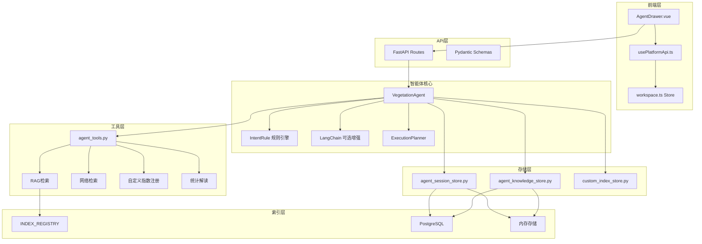
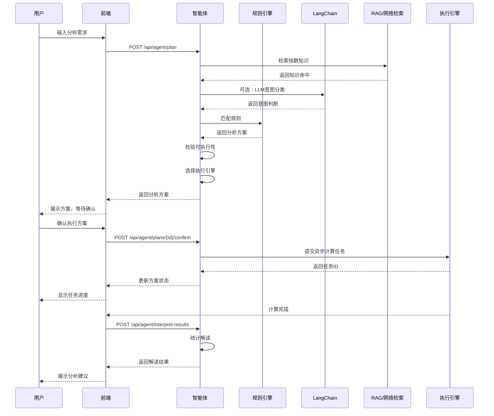

本文档详细介绍植被指数智能分析平台的智能体交互功能。智能体是一个基于混合架构的遥感分析规划器，能够将用户意图转化为安全、可审计的分析工作流。它采用"确定性规则引擎兜底 + LangChain可选增强 + RAG/网络检索 + 用户确认执行"的架构设计，确保在任何环境下都能提供可靠的分析方案。

## 架构概览

智能体交互系统采用分层架构，将确定性逻辑与可选的LLM增强相结合。核心设计原则是：**高成本计算任务的提交权永远不交给LLM**，所有执行操作都必须经过用户确认。



Sources: [agent.py](backend/app/services/agent.py#L1-L497), [agent_tools.py](backend/app/services/agent_tools.py#L1-L333), [agent_session_store.py](backend/app/services/agent_session_store.py#L1-L147)

## 核心组件

### VegetationAgent 类

`VegetationAgent` 是智能体的核心类，负责协调整个分析流程。它维护一个内部计划存储 `_plans`，用于跟踪每个分析方案的状态。

```python
@dataclass(frozen=True, slots=True)
class IntentRule:
    intent: str
    title: str
    keywords: tuple[str, ...]
    indices: tuple[str, ...]
    description: str
    warnings: tuple[str, ...]
```

智能体支持五种预定义的分析意图：

| 意图 | 标题 | 关键词示例 | 推荐指数 |
|------|------|------------|----------|
| `growth` | 作物长势空间差异分析 | 长势、健康、覆盖、生物量 | NDVI, EVI, GNDVI |
| `sparse` | 稀疏植被与裸土背景分析 | 稀疏、苗期、裸土、荒漠 | SAVI, OSAVI, MSAVI, BSI |
| `chlorophyll` | 叶绿素与氮素状态分析 | 叶绿素、氮、营养、红边 | GNDVI, NDRE, GCI, RECI |
| `water_stress` | 植被水分胁迫辅助分析 | 干旱、水分、缺水、胁迫 | NDVI, NDMI, MSI |
| `change` | 多时相植被变化监测 | 变化、两期、退化、恢复 | NDVI, EVI, NBR |

Sources: [agent.py](backend/app/services/agent.py#L24-L75)

### 工具层 (agent_tools.py)

工具层提供智能体所需的各种功能模块，每个工具都经过精心设计以确保安全性：

**RAG检索**：`search_index_knowledge` 函数首先在内置指数库中进行轻量级RAG召回，支持中英文分词和相关性评分。它会检索指数的名称、公式、描述、所需波段、分类、推荐标签和限制条件。

**网络检索**：`search_web_knowledge` 函数使用DuckDuckGo公开搜索页面解析，为指数适用场景补充网络资料。网络检索失败时会降级使用本地指数知识。

**自定义指数注册**：`register_custom_index` 函数实现运行期自定义指数注册，包含AST白名单校验、必需波段推断和NumPy试算。所有自定义指数必须通过安全验证才能注册。

**统计解读**：`interpret_products` 函数基于产品统计信息给出规则化农学建议，包括均值分析、标准差解读和下一步行动建议。

Sources: [agent_tools.py](backend/app/services/agent_tools.py#L39-L87), [agent_tools.py](backend/app/services/agent_tools.py#L90-L120), [agent_tools.py](backend/app/services/agent_tools.py#L123-L183), [agent_tools.py](backend/app/services/agent_tools.py#L201-L229)

### 会话存储 (agent_session_store.py)

会话存储模块支持两种存储模式：PostgreSQL持久化和内存存储。当数据库不可用时，系统会自动降级到内存模式，确保测试和演示环境仍能展示完整过程。

```python
CREATE_SESSION_TABLE_SQL = """
CREATE TABLE IF NOT EXISTS vegetation_agent_sessions (
    id UUID PRIMARY KEY,
    title TEXT NOT NULL DEFAULT '',
    created_at TIMESTAMPTZ NOT NULL DEFAULT now(),
    updated_at TIMESTAMPTZ NOT NULL DEFAULT now()
)
"""
```

每个会话包含多个事件，事件类型包括：
- `question`：用户问题
- `plan`：方案生成
- `execution`：任务执行
- `interpretation`：统计解读

Sources: [agent_session_store.py](backend/app/services/agent_session_store.py#L15-L34), [agent_session_store.py](backend/app/services/agent_session_store.py#L56-L72)

### 知识库存储 (agent_knowledge_store.py)

知识库存储模块用于管理外部知识文档，支持用户上传指数说明文档。知识文档会进入RAG检索流程，为智能体提供更丰富的上下文信息。

```python
CREATE_KNOWLEDGE_TABLE_SQL = """
CREATE TABLE IF NOT EXISTS vegetation_agent_knowledge_documents (
    id UUID PRIMARY KEY,
    title TEXT NOT NULL,
    content TEXT NOT NULL,
    source TEXT NOT NULL DEFAULT 'user-upload',
    session_id UUID,
    created_at TIMESTAMPTZ NOT NULL DEFAULT now()
)
"""
```

Sources: [agent_knowledge_store.py](backend/app/services/agent_knowledge_store.py#L15-L24)

### 执行规划器 (planner.py)

执行规划器根据数据规模和硬件能力选择最优的计算引擎：

```python
class ExecutionPlanner:
    """采用保守阈值，避免小任务因GPU传输产生负加速。"""
    
    def choose(self, width, height, band_count, index_count, requested="auto", is_synchronous=False):
        pixels = width * height
        estimated_memory_mb = pixels * (band_count + index_count) * 4 / 1024**2
        
        if is_synchronous or pixels < 2_000_000:
            return "numpy"  # 小型或同步任务优先降低调度开销
        
        if has_cuda() and (pixels >= 20_000_000 or index_count >= 4):
            return "torch"  # 大型或多指数任务且检测到CUDA
        
        return "joblib"  # 中大型任务使用CPU线程并行
```

| 引擎 | 适用场景 | 特点 |
|------|----------|------|
| `numpy` | 小型任务 (< 200万像素) 或同步任务 | 调度开销低，适合快速响应 |
| `joblib` | 中大型任务，无CUDA环境 | CPU线程并行，平衡性能与兼容性 |
| `torch` | 大型任务 (≥ 2000万像素) 或多指数任务，有CUDA | GPU加速，适合高计算需求 |

Sources: [planner.py](backend/app/services/planner.py#L28-L62)

## 交互流程

智能体交互遵循严格的流程设计，确保每个步骤都可追溯和可审计：



### 1. 方案生成阶段

当用户提交分析需求时，智能体会执行以下步骤：

1. **接收问题**：读取用户问题、当前可用波段和影像规模信息
2. **RAG检索指数知识**：在内置指数库和外部文档中进行轻量级RAG召回
3. **网络检索适用场景**：使用DuckDuckGo搜索补充指数适用场景（可选）
4. **注册自定义指数**：如果用户提供了自定义指数，进行AST校验和表达式试算
5. **LLM意图分类**：使用LangChain进行意图判断（可选，失败时降级规则引擎）
6. **匹配规则**：根据意图匹配预定义的分析规则
7. **校验可执行性**：比对当前影像波段与候选指数必需波段
8. **选择执行引擎**：根据数据规模和硬件能力选择最优引擎
9. **生成方案**：包含推荐指数、引擎选择、内存估算、阈值建议等

Sources: [agent.py](backend/app/services/agent.py#L82-L236)

### 2. 用户确认阶段

方案生成后，状态为 `awaiting_confirmation`。用户可以：
- 查看推荐的指数列表及其可执行性
- 修改执行引擎选择
- 调整分块大小和优先级
- 查看警告信息和风险提示
- 查看完整的执行过程轨迹

### 3. 任务执行阶段

用户确认后，智能体会：
1. 验证方案中选择的指数是否可执行
2. 提交异步计算任务到作业队列
3. 更新方案状态为 `confirmed`
4. 记录任务ID和执行配置
5. 追加会话事件

Sources: [agent.py](backend/app/services/agent.py#L244-L281)

### 4. 结果解读阶段

计算完成后，智能体会对结果进行统计解读：
- 读取产品统计信息（均值、标准差、直方图等）
- 基于规则生成农学建议
- 可选：使用LangChain生成更详细的解读
- 追加解读事件到会话

Sources: [agent.py](backend/app/services/agent.py#L379-L442)

## API接口

### 智能体相关端点

| 端点 | 方法 | 描述 | 请求体 | 响应 |
|------|------|------|--------|------|
| `/api/agent/plan` | POST | 生成分析方案 | `AgentPlanRequest` | `AgentPlan` |
| `/api/agent/plans/{plan_id}/confirm` | POST | 确认执行方案 | `ConfirmPlanRequest` | `AgentPlan` |
| `/api/agent/interpret-results` | POST | 解读计算结果 | `AgentResultInterpretRequest` | `AgentResultInterpretation` |
| `/api/agent/sessions/{session_id}/events` | GET | 获取会话事件 | - | 事件列表 |
| `/api/agent/knowledge` | POST | 导入知识文档 | `AgentKnowledgeImportRequest` | `AgentKnowledgeDocument` |
| `/api/indices/custom` | POST | 注册自定义指数 | `AgentCustomIndexRequest` | 指数元数据 |

### 请求体结构

**AgentPlanRequest**：
```typescript
{
  message: string          // 用户问题
  sessionId?: string       // 会话ID（续接对话）
  availableBands: string[] // 可用波段
  rasterWidth?: number     // 影像宽度
  rasterHeight?: number    // 影像高度
  llm?: AgentLLMConfig     // LLM配置
  enableWebSearch?: boolean // 启用网络检索
  externalDocuments?: AgentKnowledgeDocument[] // 外部文档
  customIndex?: AgentCustomIndexRequest // 自定义指数
}
```

**AgentLLMConfig**：
```typescript
{
  provider: 'openai-compatible' | 'anthropic'
  baseUrl?: string
  token?: string
  model: string
  temperature: number
}
```

Sources: [schemas.py](backend/app/api/schemas.py#L83-L97), [schemas.py](backend/app/api/schemas.py#L41-L48), [routes.py](backend/app/api/routes.py#L200-L210), [routes.py](backend/app/api/routes.py#L222-L258)

## 前端实现

### AgentDrawer 组件

`AgentDrawer.vue` 是智能体交互的主要界面组件，提供完整的对话式分析体验：

**主要功能区域**：
1. **对话输入区**：用户输入分析需求的文本框
2. **配置面板**：LLM配置、网络检索开关、自定义指数开关
3. **方案展示区**：显示推荐指数、执行引擎、警告信息
4. **会话时间线**：展示完整的对话历史
5. **执行控制区**：确认执行、查看进度
6. **结果解读区**：显示统计解读和建议

**状态管理**：
```typescript
const prompt = shallowRef('我想看这片农田哪些区域长势不好')
const isThinking = shallowRef(false)
const isInterpreting = shallowRef(false)
const llmConfig = reactive<AgentLLMConfig>({
  provider: 'openai-compatible',
  baseUrl: '',
  token: '',
  model: 'gpt-4.1-mini',
  temperature: 0,
})
```

**关键操作流程**：
1. `generatePlan()`：调用API生成分析方案
2. `confirmPlan()`：确认方案并提交执行
3. `interpretResults()`：解读计算结果
4. `importKnowledge()`：导入知识文档

Sources: [AgentDrawer.vue](frontend/src/components/AgentDrawer.vue#L1-L50), [AgentDrawer.vue](frontend/src/components/AgentDrawer.vue#L148-L166), [AgentDrawer.vue](frontend/src/components/AgentDrawer.vue#L168-L189)

### API客户端

`usePlatformApi.ts` 提供智能体相关的API调用方法：

```typescript
export function usePlatformApi() {
  async function createPlan(message, availableBands, options): Promise<AgentPlan> {
    return requestJson<AgentPlan>('/api/agent/plan', {
      method: 'POST',
      body: JSON.stringify({
        message,
        sessionId: options.sessionId,
        availableBands,
        llm: options.llm,
        enableWebSearch: options.enableWebSearch ?? true,
        customIndex: options.customIndex,
      }),
    })
  }
  
  async function confirmPlan(planId, localPath, bands, executionSheet): Promise<AgentPlan> {
    return requestJson<AgentPlan>(`/api/agent/plans/${planId}/confirm`, {
      method: 'POST',
      body: JSON.stringify({
        source: { localPath },
        bands,
        indices: executionSheet.indices,
        engine: executionSheet.engine,
        blockSize: executionSheet.blockSize,
        priority: executionSheet.priority,
      }),
    })
  }
}
```

Sources: [usePlatformApi.ts](frontend/src/composables/usePlatformApi.ts#L80-L106), [usePlatformApi.ts](frontend/src/composables/usePlatformApi.ts#L108-L125)

### 数据类型定义

智能体交互涉及的主要数据类型：

```typescript
interface AgentPlan {
  id: string
  sessionId: string
  status: 'awaiting_confirmation' | 'confirmed'
  intent: string
  title: string
  summary: string
  recommendations: AgentRecommendation[]
  selectedIndices: string[]
  engine: 'numpy' | 'joblib' | 'torch'
  engineReason: string
  estimatedMemoryMb: number
  suggestedBlockSize: number
  warnings: string[]
  requiresConfirmation: boolean
  canExecute: boolean
  trace: AgentTraceStep[]
  processSteps: AgentTraceStep[]
  knowledgeHits: AgentKnowledgeHit[]
  webHits: AgentKnowledgeHit[]
  llmStatus: 'used' | 'skipped' | 'failed'
  llmProvider: string
  llmMessage: string
  customIndex?: IndexMetadata | null
  agentMode: string
  conversation: AgentConversationEvent[]
  jobId?: string
}
```

Sources: [platform.ts](frontend/src/types/platform.ts#L89-L116)

## 配置与扩展

### LLM配置

智能体支持两种LLM提供商：

1. **OpenAI兼容**：支持任何兼容OpenAI API的服务
2. **Anthropic**：支持Claude系列模型

配置可以通过前端界面动态设置，也可以通过环境变量预配置：

```python
# 后端默认配置
settings.openai_base_url  # OpenAI兼容API地址
settings.openai_api_key   # API密钥
settings.openai_model     # 默认模型
```

**重要安全特性**：LLM配置不会持久化到数据库，每次会话都需要用户重新输入。

### 知识库扩展

用户可以通过以下方式扩展智能体的知识库：

1. **导入知识文档**：上传指数说明文档，进入RAG检索流程
2. **注册自定义指数**：定义新的植被指数公式
3. **使用外部文档**：在方案生成时提供外部参考资料

```python
# 导入知识文档
POST /api/agent/knowledge
{
  "title": "植被指数适用场景说明",
  "content": "文档内容...",
  "source": "user-upload"
}

# 注册自定义指数
POST /api/indices/custom
{
  "id": "custom_nd",
  "name": "自定义归一化差异指数",
  "expression": "(nir - red) / (nir + red)",
  "description": "用于演示运行期新增指数"
}
```

Sources: [agent_tools.py](backend/app/services/agent_tools.py#L123-L183), [routes.py](backend/app/api/routes.py#L276-L290)

### 存储模式

智能体系统支持两种存储模式，可根据环境自动降级：

| 组件 | PostgreSQL模式 | 内存模式 |
|------|----------------|----------|
| 会话存储 | 持久化会话和事件 | 内存存储，重启丢失 |
| 知识库存储 | 持久化知识文档 | 内存存储，重启丢失 |
| 自定义指数 | 持久化到PostgreSQL | 内存存储，重启丢失 |

系统会通过 `/api/system/capabilities` 接口暴露当前的存储模式：

```typescript
interface SystemCapabilities {
  agentSessionStorage: 'postgresql' | 'memory'
  agentKnowledgeStorage: 'postgresql' | 'memory'
  customIndexStorage: 'postgresql' | 'memory'
  agentMode: string
}
```

Sources: [agent_session_store.py](backend/app/services/agent_session_store.py#L37-L39), [agent_knowledge_store.py](backend/app/services/agent_knowledge_store.py#L27-L29), [platform.ts](frontend/src/types/platform.ts#L182-L194)

## 安全与边界

### 设计原则

智能体系统遵循以下安全设计原则：

1. **确定性优先**：规则引擎作为可靠兜底，LLM仅作为可选增强
2. **确认执行**：高成本计算任务必须经过用户确认
3. **安全校验**：自定义指数必须通过AST白名单校验和表达式试算
4. **降级策略**：任何组件失败都会降级到更安全的模式
5. **审计追踪**：所有操作都有完整的会话事件记录

### 边界限制

- **不直接执行代码**：LLM不能直接执行代码、写文件或选择任意路径
- **不自动提交任务**：所有计算任务都需要用户明确确认
- **波段校验**：系统会校验所需波段是否可用，缺少波段的指数会被标记为不可执行
- **表达式安全**：自定义指数表达式只能使用白名单中的函数和波段

Sources: [skills/vegetation-agent-designer/SKILL.md](skills/vegetation-agent-designer/SKILL.md#L20-L29)

## 测试验证

智能体系统包含完整的测试用例，覆盖以下场景：

1. **意图识别**：验证不同用户输入能正确匹配分析意图
2. **波段校验**：验证缺少必需波段时正确标记不可执行指数
3. **确认流程**：验证方案必须经过确认才能执行
4. **会话事件**：验证方案生成和结果解读正确追加会话事件
5. **RAG检索**：验证导入的知识文档能进入检索流程
6. **自定义指数**：验证安全校验和表达式试算

```python
def test_agent_recommends_growth_workflow():
    plan = asyncio.run(vegetation_agent.create_plan(
        "我想看这片农田哪些区域长势不好",
        ["blue", "green", "red", "nir"],
        5000, 5000
    ))
    assert plan["intent"] == "growth"
    assert plan["selectedIndices"] == ["ndvi", "evi", "gndvi"]
    assert plan["requiresConfirmation"] is True
    assert plan["canExecute"] is True
```

Sources: [test_agent.py](backend/tests/test_agent.py#L10-L24)

## 相关页面

- [智能体架构](17-zhi-neng-ti-jia-gou)：深入了解智能体的架构设计
- [意图识别与规划](18-yi-tu-shi-bie-yu-gui-hua)：了解意图识别和规划机制
- [RAG知识检索](19-ragzhi-shi-jian-suo)：了解RAG检索的实现细节
- [自定义指数管理](20-zi-ding-yi-zhi-shu-guan-li)：了解自定义指数的管理
- [任务管理](8-ren-wu-guan-li)：了解任务执行和监控
- [REST API](25-rest-api)：查看完整的API文档