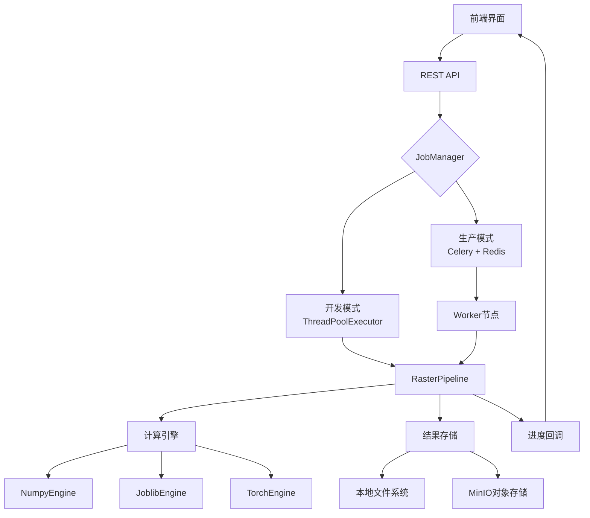
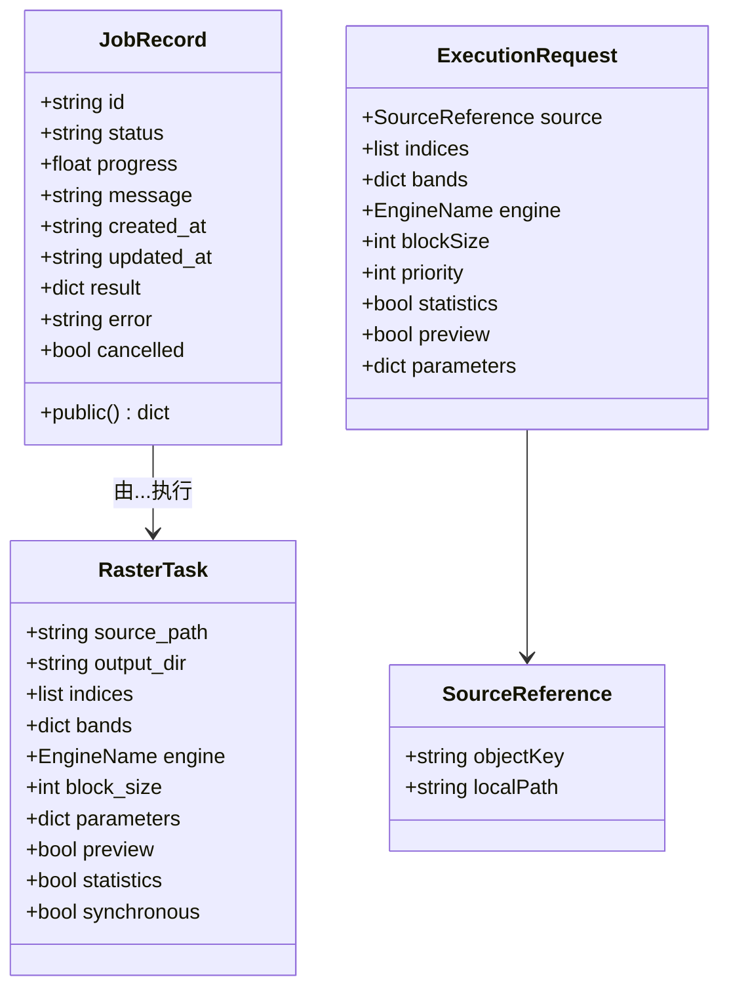
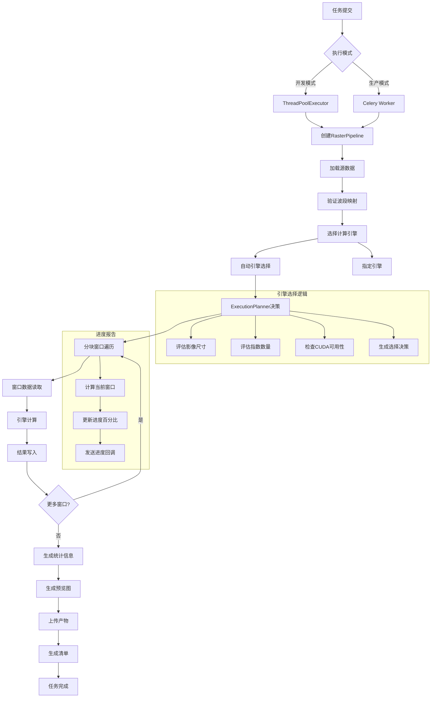
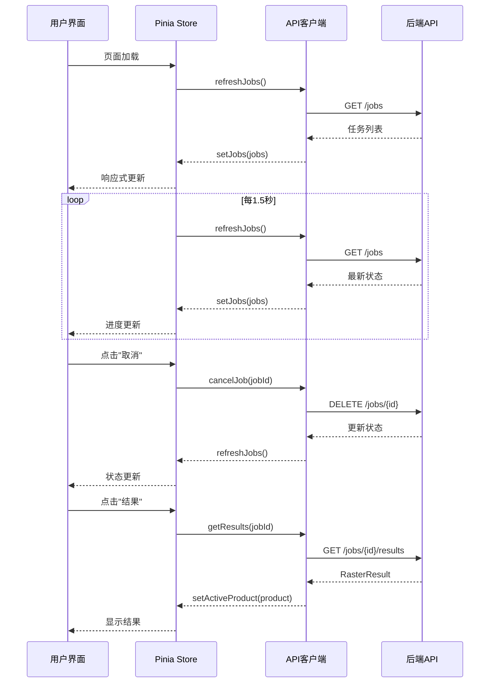
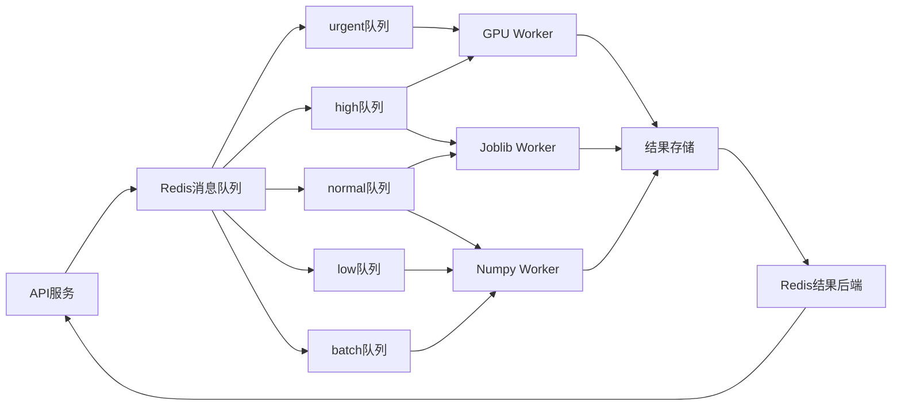
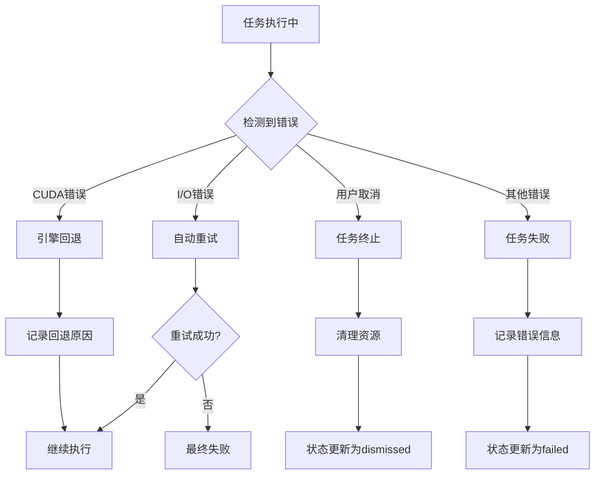

本页面详细说明植被指数智能分析平台中的任务管理系统，涵盖任务创建、执行、监控和结果回收的完整生命周期。任务管理模块通过RESTful API、后端服务和前端界面的协同工作，为用户提供可靠、可扩展的异步计算能力。

## 系统架构概览

任务管理系统采用**双模式架构**，根据运行环境自动切换执行策略：在开发环境中使用线程池进行轻量级任务处理，在生产环境中通过Celery消息队列实现分布式任务调度。这种设计确保了开发效率与生产环境可扩展性的平衡。

任务的核心执行单元是**RasterTask**，它封装了栅格处理的所有参数，包括源文件路径、输出目录、计算指数列表、波段映射、引擎选择、分块大小等配置。系统通过`JobManager`统一管理任务生命周期，提供提交、查询、取消等操作接口。



Sources: [jobs.py](backend/app/services/jobs.py#L1-L155), [raster_pipeline.py](backend/app/services/raster_pipeline.py#L1-L288)

## 核心数据结构

任务管理系统依赖几个关键的数据结构来维护状态和传递参数：

**JobRecord**是任务状态的核心载体，包含任务ID、当前状态、进度百分比、状态消息、创建时间、更新时间、结果数据和错误信息等字段。任务状态通过枚举值管理，确保状态转换的一致性。



任务状态转换遵循严格的状态机规则，确保任务生命周期管理的可靠性：

| 状态 | 英文标识 | 描述 | 允许的转换 |
|------|----------|------|------------|
| 排队 | `accepted` | 任务已接受，等待执行 | → `running`, `failed`, `dismissed` |
| 运行 | `running` | 任务正在执行中 | → `successful`, `failed`, `dismissed` |
| 成功 | `successful` | 任务执行完成 | 终态 |
| 失败 | `failed` | 任务执行失败 | 终态 |
| 取消 | `dismissed` | 任务被用户取消 | 终态 |

Sources: [jobs.py](backend/app/services/jobs.py#L30-L50), [platform.ts](frontend/src/types/platform.ts#L120-L135), [schemas.py](backend/app/api/schemas.py#L40-L60)

## 任务执行流程

任务执行遵循标准化的处理流程，确保计算的一致性和可追溯性。整个流程从任务提交开始，经过引擎选择、分块计算、结果生成和清单记录等阶段。



**引擎自动选择**是系统的关键特性，`ExecutionPlanner`基于多个维度进行决策：
- **影像尺寸**：像素数量影响计算复杂度
- **指数数量**：批量计算需要并行支持
- **CUDA可用性**：GPU加速可显著提升性能
- **同步/异步模式**：不同模式对资源需求不同

Sources: [raster_pipeline.py](backend/app/services/raster_pipeline.py#L150-L250), [planner.py](backend/app/services/planner.py#L1-L50)

## REST API 接口

任务管理系统通过RESTful API暴露完整的任务管理能力，符合OGC API - Processes标准，支持同步和异步执行模式。

### 任务执行接口

执行任务的核心接口支持多种执行策略，通过HTTP头控制执行模式：

```http
POST /processes/{process_id}/execution
Content-Type: application/json
Prefer: respond-async

{
  "source": {
    "localPath": "/path/to/input.tif"
  },
  "indices": ["ndvi", "evi"],
  "bands": {
    "red": 3,
    "nir": 5
  },
  "engine": "auto",
  "blockSize": 1024,
  "priority": 3,
  "statistics": true,
  "preview": true
}
```

**请求参数说明**：

| 参数 | 类型 | 必填 | 描述 | 默认值 |
|------|------|------|------|--------|
| `source` | object | 是 | 数据源引用（objectKey或localPath） | - |
| `indices` | array | 是 | 计算指数ID列表（1-30个） | - |
| `bands` | object | 是 | 逻辑波段到物理波段的映射 | - |
| `engine` | string | 否 | 计算引擎（auto/numpy/joblib/torch） | `auto` |
| `blockSize` | integer | 否 | 分块大小（128-2048像素） | `1024` |
| `priority` | integer | 否 | 任务优先级（1-5，1最高） | `3` |
| `statistics` | boolean | 否 | 是否计算统计信息 | `true` |
| `preview` | boolean | 否 | 是否生成预览图 | `true` |

**响应格式**：

```json
// 同步执行成功
{
  "status": "successful",
  "outputs": {
    "actualEngine": "numpy",
    "durationSeconds": 1.234,
    "fallbackReasons": [],
    "products": [...]
  }
}

// 异步执行成功
{
  "jobID": "a1b2c3d4e5f6...",
  "status": "accepted",
  "location": "/jobs/a1b2c3d4e5f6..."
}
```

Sources: [routes.py](backend/app/api/routes.py#L100-L180), [schemas.py](backend/app/api/schemas.py#L40-L80)

### 任务查询接口

系统提供完整的任务查询能力，支持列表查看、详情查询和结果获取：

| 端点 | 方法 | 描述 | 响应 |
|------|------|------|------|
| `/jobs` | GET | 获取所有任务列表 | `{"jobs": [...]}` |
| `/jobs/{job_id}` | GET | 获取单个任务详情 | JobRecord对象 |
| `/jobs/{job_id}/results` | GET | 获取任务结果 | RasterResult对象 |
| `/jobs/{job_id}` | DELETE | 取消任务 | 更新后的JobRecord |

**任务列表响应示例**：

```json
{
  "jobs": [
    {
      "id": "a1b2c3d4e5f6...",
      "status": "running",
      "progress": 65.5,
      "message": "正在计算窗口 13/20",
      "created_at": "2026-06-22T10:30:00Z",
      "updated_at": "2026-06-22T10:31:15Z",
      "error": null
    }
  ]
}
```

Sources: [routes.py](backend/app/api/routes.py#L180-L220), [usePlatformApi.ts](frontend/src/composables/usePlatformApi.ts#L120-L150)

## 前端界面集成

任务管理在前端通过`JobProgressPanel`组件实现可视化监控，提供实时的任务状态更新和交互控制。

### 组件交互设计

前端任务管理遵循**状态驱动**的设计模式，通过Pinia store管理全局状态，组件通过props接收数据，通过emit发送用户操作。



### 状态管理策略

`useWorkspaceStore`维护任务相关的全局状态：

```typescript
// 核心状态
const jobs = shallowRef<JobRecord[]>([])
const runningJobs = computed(() => 
  jobs.value.filter(job => ['accepted', 'running'].includes(job.status))
)
const completedJobs = computed(() => 
  jobs.value.filter(job => job.status === 'successful')
)

// 关键方法
function setJobs(value: JobRecord[]) {
  jobs.value = value
}

// 操作方法
async function cancelJob(job: JobRecord) {
  await api.cancelJob(job.id)
  await refreshJobs()
}

async function selectJobResult(job: JobRecord) {
  const result = await api.getResults(job.id)
  store.setActiveProduct(result.products[0] ?? null)
}
```

**状态同步机制**：前端通过定时轮询（每1.5秒）与后端保持状态同步，确保用户界面实时反映任务执行进度。轮询间隔经过性能优化，平衡实时性与服务器负载。

Sources: [JobProgressPanel.vue](frontend/src/components/JobProgressPanel.vue#L1-L208), [workspace.ts](frontend/src/stores/workspace.ts#L60-L120), [App.vue](frontend/src/App.vue#L30-L60)

## 生产环境部署

在生产环境中，任务管理系统通过Celery实现分布式任务处理，结合Redis消息队列和多种Worker类型，提供高可用、可扩展的任务执行能力。

### Celery配置架构

系统配置了**五级优先队列**，支持不同优先级任务的调度：

| 队列名称 | 优先级 | 路由键 | 用途 |
|----------|--------|--------|------|
| `urgent` | 1 | `priority.1` | 紧急任务 |
| `high` | 2 | `priority.2` | 高优先级 |
| `normal` | 3 | `priority.3` | 常规任务 |
| `low` | 4 | `priority.4` | 低优先级 |
| `batch` | 5 | `priority.5` | 批量处理 |

**Worker类型配置**：

| Worker类型 | 绑定队列 | 并发数 | 资源需求 |
|------------|----------|--------|----------|
| `worker-numpy` | normal, low, batch | 1 | CPU |
| `worker-joblib` | urgent, high, normal | 2 | CPU |
| `worker-gpu` | 所有队列 | 1 | GPU |



**部署配置示例**：

```yaml
# Celery应用配置
celery_app = Celery(
    "vegetation_jobs",
    broker=settings.redis_url,
    backend=settings.redis_url,
    include=["app.worker_tasks"],
)
celery_app.conf.update(
    task_track_started=True,
    task_serializer="json",
    result_serializer="json",
    broker_transport_options={"queue_order_strategy": "priority"},
    task_queues=(
        Queue("urgent", routing_key="priority.1"),
        Queue("high", routing_key="priority.2"),
        Queue("normal", routing_key="priority.3"),
        Queue("low", routing_key="priority.4"),
        Queue("batch", routing_key="priority.5"),
    ),
    task_default_queue="normal",
)
```

**Worker启动命令**：

```bash
# Numpy Worker - 处理常规和批量任务
celery -A app.celery_app:celery_app worker -Q normal,low,batch --loglevel=INFO --concurrency=1 --hostname=numpy@%h

# Joblib Worker - 处理高优先级任务
celery -A app.celery_app:celery_app worker -Q urgent,high,normal --loglevel=INFO --concurrency=2 --hostname=joblib@%h

# GPU Worker - 处理所有队列
celery -A app.celery_app:celery_app worker -Q urgent,high,normal,low,batch --loglevel=INFO --concurrency=1 --hostname=gpu@%h
```

Sources: [celery_app.py](backend/app/celery_app.py#L1-L30), [compose.yml](compose.yml#L80-L130), [jobs.py](backend/app/services/jobs.py#L100-L155)

## 错误处理与容错机制

任务管理系统实现了多层次的错误处理策略，确保系统稳定性和用户体验：

### 任务级容错

1. **自动重试**：针对I/O错误（如文件系统暂时不可用），Celery任务配置自动重试机制
2. **优雅降级**：当CUDA不可用时，自动回退到CPU引擎
3. **取消传播**：用户取消操作立即传播到执行线程/进程



### 进度报告容错

进度报告机制设计为**幂等且容错**：
- 进度回调函数捕获所有异常
- 状态更新使用原子操作
- 前端轮询与后端状态解耦

```python
def progress(current: int, total: int, message: str) -> None:
    try:
        record.progress = round(current / max(total, 1) * 100, 2)
        record.message = message
        record.updated_at = datetime.now(UTC).isoformat()
    except Exception:
        # 进度更新失败不应影响任务执行
        pass
```

Sources: [jobs.py](backend/app/services/jobs.py#L80-L100), [worker_tasks.py](backend/app/worker_tasks.py#L10-L22)

## 性能优化策略

任务管理系统在多个层面实施性能优化，确保大规模数据处理效率：

### 计算引擎优化

| 引擎 | 适用场景 | 优化特性 | 性能特点 |
|------|----------|----------|----------|
| `numpy` | 小型影像，快速原型 | 向量化计算 | 低延迟，单线程 |
| `joblib` | 中型影像，并行计算 | 多进程并行 | CPU利用率高 |
| `torch` | 大型影像，批量计算 | GPU加速 | 吞吐量最高 |

**自动引擎选择算法**：

```python
def choose(self, width: int, height: int, band_count: int, index_count: int, 
           engine: str, synchronous: bool) -> EngineDecision:
    pixels = width * height
    
    # 同步模式优先使用numpy
    if synchronous:
        return EngineDecision("numpy", "同步执行模式")
    
    # 小型影像使用numpy
    if pixels < 2_000_000:
        return EngineDecision("numpy", "影像尺寸小于200万像素")
    
    # 大型批量计算使用torch（如果可用）
    if pixels > 20_000_000 and index_count >= 4 and has_cuda():
        return EngineDecision("torch", "大型批量计算，CUDA可用")
    
    # 其他情况使用joblib
    return EngineDecision("joblib", "中型影像，并行计算")
```

### 存储优化

1. **分块处理**：将大影像分割为1024×1024像素的块，减少内存占用
2. **延迟写入**：结果先写入本地，再异步上传到MinIO
3. **增量统计**：分块计算统计信息，避免全量加载

Sources: [raster_pipeline.py](backend/app/services/raster_pipeline.py#L80-L120), [planner.py](backend/app/services/planner.py#L30-L80)

## 最佳实践

### 开发环境配置

```python
# 开发环境使用线程池
settings.celery_always_eager = True

# 快速同步执行
result = job_manager.execute_sync(task)

# 调试时查看完整清单
manifest_path = output_dir / "manifest.json"
```

### 生产环境监控

```python
# 监控任务队列长度
from app.celery_app import celery_app
inspect = celery_app.control.inspect()
active = inspect.active()
reserved = inspect.reserved()

# 监控Worker状态
ping = celery_app.control.ping()
```

### 前端集成示例

```typescript
// 提交异步任务
const { jobID } = await api.executeAssetBatch(
  '/path/to/input.tif',
  ['ndvi', 'evi'],
  { red: 3, nir: 5 }
)

// 轮询任务状态
const job = await api.getJob(jobID)
console.log(`任务进度: ${job.progress}%`)

// 获取任务结果
const result = await api.getResults(jobID)
console.log(`计算耗时: ${result.durationSeconds}秒`)
```

## 下一步探索

了解任务管理后，建议继续阅读以下页面以深入理解系统架构：

- [任务调度系统](16-ren-wu-diao-du-xi-tong)：深入了解Celery配置和Worker管理
- [栅格处理流水线](15-zha-ge-chu-li-liu-shui-xian)：了解分块计算和引擎选择细节
- [系统架构](9-xi-tong-jia-gou)：查看任务管理在整体架构中的位置
- [前端架构](11-qian-duan-jia-gou)：了解前端状态管理和组件设计模式