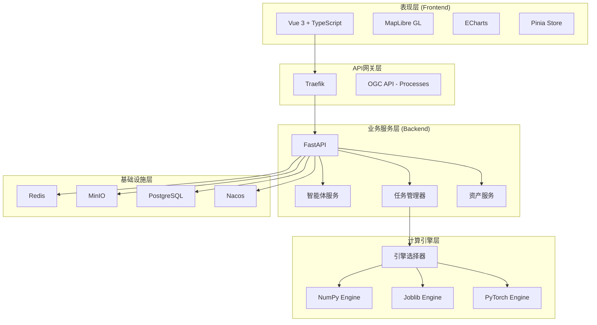
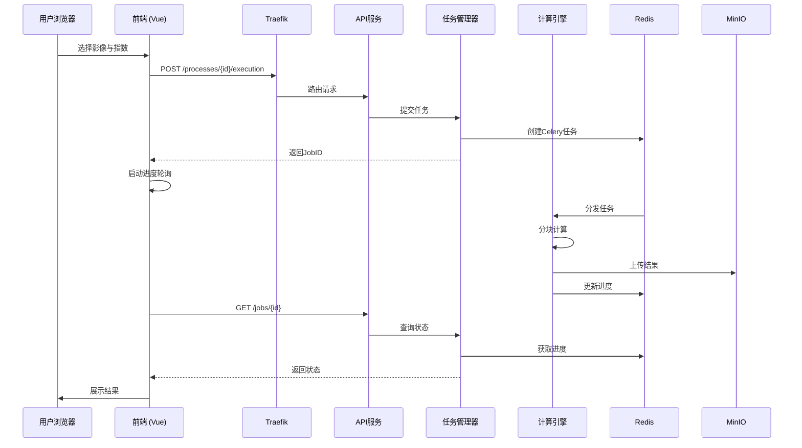
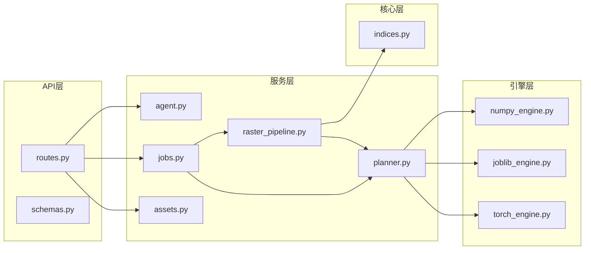
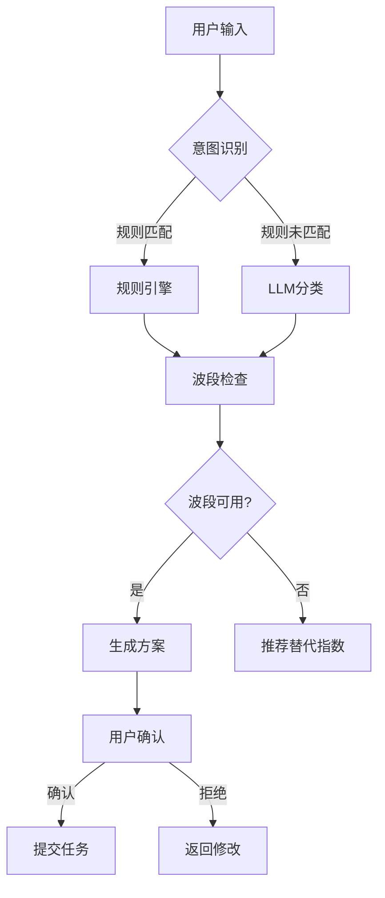

本文档描述植被指数智能分析平台的整体系统架构。平台采用前后端分离的微服务架构设计，通过容器化部署实现高可用与可扩展性。文档面向需要理解系统整体结构、数据流和组件交互的开发者。

## 架构概览

平台采用**分层架构**设计，将系统划分为五个核心层次：表现层、API网关层、业务服务层、计算引擎层和基础设施层。每一层职责清晰，通过标准接口进行交互，实现了关注点分离和模块解耦。



Sources: [compose.yml](compose.yml#L1-L192), [main.py](backend/app/main.py#L1-L55), [App.vue](frontend/src/App.vue#L1-L50)

## 核心组件交互

系统的核心数据流遵循**请求-响应-执行**模式。用户通过前端界面发起计算请求，经过API网关路由到后端服务，由任务管理器协调计算引擎执行，并将结果存储到对象存储中。



Sources: [routes.py](backend/app/api/routes.py#L1-L100), [jobs.py](backend/app/services/jobs.py#L1-L100), [raster_pipeline.py](backend/app/services/raster_pipeline.py#L1-L100)

## 前端架构

前端采用**Vue 3 Composition API**构建，结合TypeScript提供类型安全。核心组件包括：

| 组件 | 职责 | 关键技术 |
|------|------|----------|
| MapWorkspace | 地图可视化与叠加 | MapLibre GL JS |
| StatisticsDashboard | 统计图表展示 | ECharts |
| AgentDrawer | 智能体交互面板 | 流式响应 |
| JobProgressPanel | 任务进度监控 | 轮询更新 |
| IndexCatalog | 指数目录浏览 | 分类筛选 |
| AppToolbar | 主题与布局控制 | 响应式设计 |

状态管理使用Pinia，通过`useWorkspaceStore`集中管理应用状态，包括指数列表、任务队列、智能体方案和系统能力。

Sources: [workspace.ts](frontend/src/stores/workspace.ts#L1-L80), [App.vue](frontend/src/App.vue#L1-L50), [usePlatformApi.ts](frontend/src/composables/usePlatformApi.ts#L1-L80)

## 后端架构

后端基于**FastAPI**框架构建，采用分层架构设计：



**API层**提供RESTful接口和OGC API - Processes兼容端点，处理请求验证和响应格式化。**服务层**包含业务逻辑，包括智能体规划、任务调度、资产管理和栅格处理流水线。**核心层**维护指数注册表，存储30种植被指数的元数据和计算公式。**引擎层**实现多后端计算，通过统一协议支持NumPy、Joblib和PyTorch。

Sources: [routes.py](backend/app/api/routes.py#L1-L496), [settings.py](backend/app/settings.py#L1-L33), [indices.py](backend/app/core/indices.py#L1-L80)

## 多引擎计算架构

平台的核心创新在于**多引擎统一计算架构**。通过定义`ComputeEngine`协议，实现了公式定义与执行后端的解耦：

```python
class ComputeEngine(Protocol):
    name: str
    def compute(
        self,
        definitions: list[IndexDefinition],
        bands: dict[str, np.ndarray],
        parameters: dict[str, dict[str, float]] | None = None,
    ) -> EngineResult: ...
```

三个引擎实现遵循相同协议：

| 引擎 | 适用场景 | 并行策略 | 硬件要求 |
|------|----------|----------|----------|
| NumpyEngine | 小型同步任务 | 单线程 | CPU |
| JoblibEngine | 中大型CPU任务 | 多线程 | CPU |
| TorchEngine | 大型多指数任务 | CUDA加速 | GPU |

引擎选择由`ExecutionPlanner`自动决策，基于像素数量、指数数量和硬件能力：

- **同步任务**或**像素<200万**：选择NumPy，降低调度开销
- **像素≥2000万**或**指数≥4且CUDA可用**：选择PyTorch GPU
- **其他情况**：选择Joblib CPU并行

Sources: [base.py](backend/app/engines/base.py#L1-L35), [numpy_engine.py](backend/app/engines/numpy_engine.py#L1-L34), [torch_engine.py](backend/app/engines/torch_engine.py#L1-L60), [planner.py](backend/app/services/planner.py#L1-L62)

## 任务调度系统

任务调度采用**Celery + Redis**实现异步处理，支持五级优先队列：

| 优先级 | 队列名称 | 适用场景 |
|--------|----------|----------|
| 1 | urgent | 紧急任务 |
| 2 | high | 高优先级 |
| 3 | normal | 普通任务（默认） |
| 4 | low | 低优先级 |
| 5 | batch | 批量处理 |

任务生命周期管理通过`JobManager`实现，支持同步执行、异步执行、进度查询和任务取消。开发模式使用线程池，部署模式由Celery Worker处理。

Sources: [celery_app.py](backend/app/celery_app.py#L1-L30), [jobs.py](backend/app/services/jobs.py#L1-L155), [worker_tasks.py](backend/app/worker_tasks.py#L1-L22)

## 栅格处理流水线

`RasterPipeline`是核心计算组件，采用**分块处理**策略避免内存溢出：

1. **读取阶段**：使用Rasterio按窗口读取GeoTIFF，不加载整幅影像
2. **计算阶段**：选择合适的引擎执行指数计算
3. **写入阶段**：逐块写入结果，生成统计信息和预览图
4. **清单阶段**：生成可复现的处理记录（输入哈希、引擎、参数）

流水线支持进度回调和取消检查，确保长时间任务的可控性。

Sources: [raster_pipeline.py](backend/app/services/raster_pipeline.py#L1-L100)

## 智能体系统

智能体采用**规则优先、LLM可插拔**的设计，确保安全性和可解释性：



智能体**安全边界**：
- 不生成任意Python代码
- 不接收任意输出路径
- 用户确认前不提交计算

Sources: [agent.py](backend/app/services/agent.py#L1-L100), [planner.py](backend/app/services/planner.py#L1-L62)

## 基础设施架构

容器化部署通过Docker Compose编排，包含以下核心服务：

| 服务 | 镜像 | 职责 |
|------|------|------|
| traefik | traefik:v3.4 | 反向代理与负载均衡 |
| frontend | 自定义构建 | 静态资源服务 |
| api-basic | 自定义构建 | 基础API服务 |
| api-adjusted | 自定义构建 | 调整API服务 |
| api-advanced | 自定义构建 | 高级API服务 |
| worker-numpy | 自定义构建 | CPU计算Worker |
| worker-joblib | 自定义构建 | 多线程计算Worker |
| worker-gpu | 自定义构建 | GPU计算Worker |
| redis | redis:7.4-alpine | 消息队列与缓存 |
| minio | minio/minio | 对象存储 |
| nacos | nacos/nacos-server | 服务发现 |
| nacos-bridge | 自定义构建 | Nacos-Traefik桥接 |

**服务发现机制**：Nacos注册中心管理API实例健康状态，`nacos_bridge`定期轮询并生成Traefik File Provider配置，实现动态负载均衡。

Sources: [compose.yml](compose.yml#L1-L192), [traefik.yml](infra/traefik/traefik.yml#L1-L19), [nacos.py](backend/app/services/nacos.py#L1-L60), [nacos_bridge.py](backend/app/nacos_bridge.py#L1-L80)

## 数据存储架构

平台采用**多存储策略**满足不同数据需求：

| 存储类型 | 技术 | 用途 | 持久性 |
|----------|------|------|--------|
| 对象存储 | MinIO | 输入影像、结果GeoTIFF、预览图 | 持久化 |
| 缓存队列 | Redis | Celery任务队列、进度状态 | 持久化(AOF) |
| 关系数据库 | PostgreSQL | 自定义指数、智能体会话 | 可选 |
| 本地文件系统 | Docker Volume | 开发模式数据 | 持久化 |

存储层通过环境变量配置，支持开发模式（本地文件系统）和部署模式（MinIO + PostgreSQL）无缝切换。

Sources: [settings.py](backend/app/settings.py#L1-L33), [custom_index_store.py](backend/app/services/custom_index_store.py#L1-L60), [agent_session_store.py](backend/app/services/agent_session_store.py#L1-L60)

## 配置管理

配置通过**环境变量**和**Pydantic Settings**管理，支持`.env`文件和Docker Compose环境注入：

| 配置前缀 | 说明 | 示例 |
|----------|------|------|
| VIP_ | 平台通用配置 | VIP_REDIS_URL |
| MINIO_ | MinIO存储配置 | MINIO_ROOT_USER |
| NACOS_ | Nacos服务发现 | NACOS_AUTH_ENABLE |

开发模式默认使用本地Redis和文件系统，部署模式通过环境变量切换到容器化服务。

Sources: [settings.py](backend/app/settings.py#L1-L33), [.env.example](.env.example)

## 扩展性设计

系统架构支持以下扩展维度：

**水平扩展**：通过增加API实例和Worker数量提升处理能力。Nacos自动注册新实例，Traefik动态调整负载均衡策略。

**引擎扩展**：实现`ComputeEngine`协议即可添加新计算后端，无需修改核心逻辑。

**指数扩展**：在`INDEX_DEFINITIONS`元组中添加新的`IndexDefinition`即可注册新指数，公式函数通过`xp`参数支持多后端执行。

**存储扩展**：存储层抽象支持替换为其他对象存储（如S3）或数据库（如MySQL），只需实现相应适配器。

Sources: [base.py](backend/app/engines/base.py#L1-L35), [indices.py](backend/app/core/indices.py#L1-L80)

## 阅读建议

理解本架构文档后，建议按以下顺序深入学习：

1. **[后端架构](10-hou-duan-jia-gou)**：深入了解FastAPI服务设计
2. **[前端架构](11-qian-duan-jia-gou)**：学习Vue组件与状态管理
3. **[计算引擎](14-ji-suan-yin-qing)**：掌握多引擎实现细节
4. **[任务调度系统](16-ren-wu-diao-du-xi-tong)**：理解异步任务处理
5. **[智能体架构](17-zhi-neng-ti-jia-gou)**：探索智能体设计
6. **[基础设施架构](12-ji-chu-she-shi-jia-gou)**：学习容器化部署