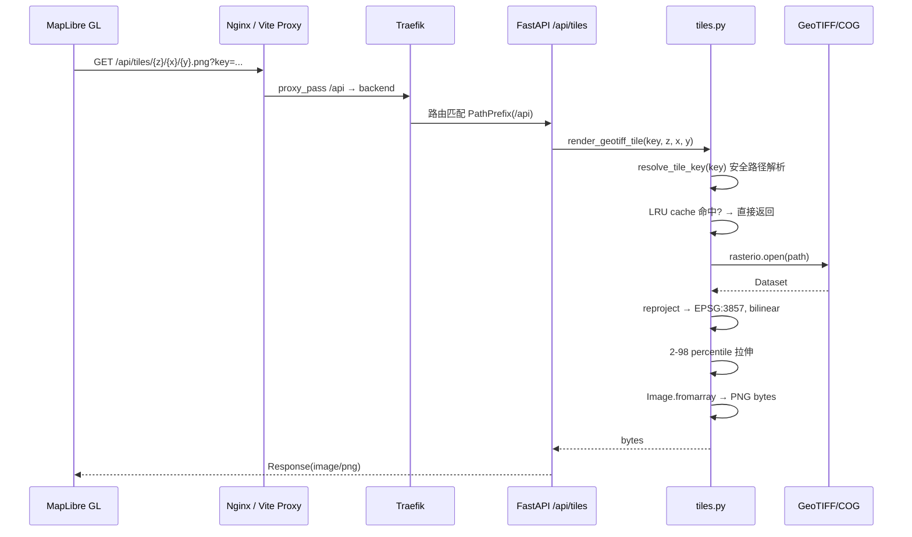
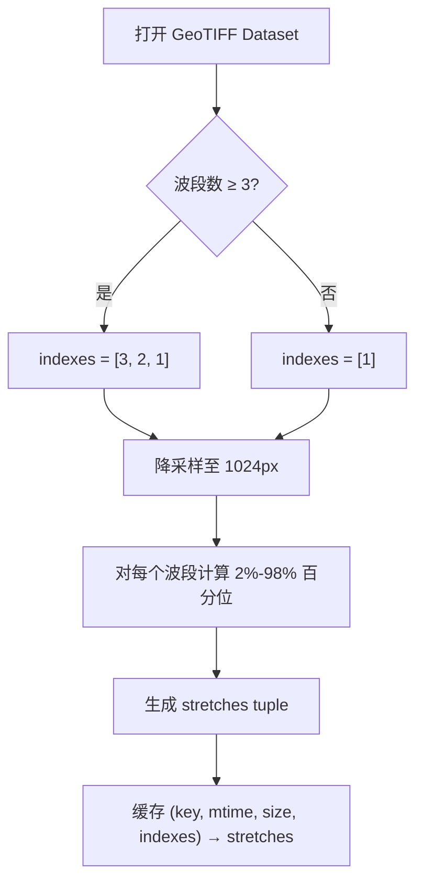
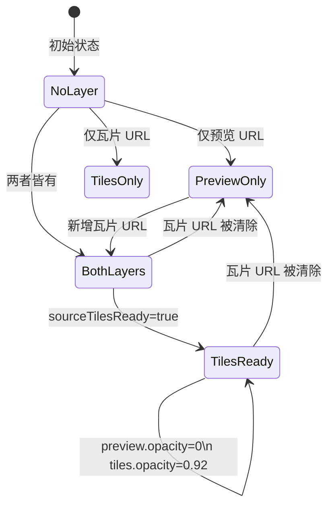
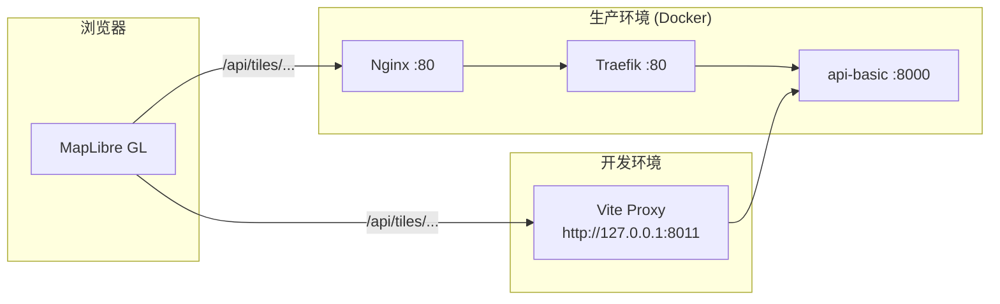

本页聚焦前端如何将 GeoTIFF/COG 影像通过后端动态瓦片 API 实时渲染到 MapLibre 地图上，以及图层面板如何控制底图、源影像、分析结果与范围框的可见性、叠放顺序和对比模式。

## 瓦片请求链路总览

用户在前端导入遥感影像或触发指数计算后，`MapWorkspace` 组件并不直接下载整张 GeoTIFF，而是构造一张 **XYZ 瓦片模板 URL**，由 MapLibre 按视口逐片请求后端动态渲染服务。全链路经过 Nginx → Traefik → FastAPI 路由 → Rasterio 读取 → NumPy 拉伸 → PNG 输出，最终以 `image/png` 响应返回前端瓦片层。

瓦片模板 URL 在前端由 `tileUrl()` 函数构造，格式为 `/api/tiles/{z}/{x}/{y}.png?key={encodedObjectKey}`，其中 `{z}/{x}/{y}` 是 MapLibre 自动替换的标准瓦片坐标。

Sources: [routes.py](backend/app/api/routes.py#L220-L235), [tiles.py](backend/app/services/tiles.py#L39-L42), [MapWorkspace.vue](frontend/src/components/MapWorkspace.vue#L107-L112)

## 后端瓦片渲染管线

后端瓦片服务的核心入口是 `render_geotiff_tile(key, z, x, y)` 函数。它接收前端传入的文件对象键（`objectKey`）和 XYZ 瓦片坐标，输出 256×256 的 PNG 字节流。整个管线分为 **路径安全解析**、**缓存判断**、**坐标重投影**、**波段拉伸** 和 **像素渲染** 五个阶段。

### 路径安全解析

`resolve_tile_key()` 将前端传入的对象键规范化为 `settings.data_dir` 下的本地文件路径，并通过 `pathlib.Path.resolve()` 防止路径穿越攻击。若目标文件不在数据目录内或不存在，抛出 `FileNotFoundError`。

Sources: [tiles.py](backend/app/services/tiles.py#L27-L37)

### LRU 缓存策略

瓦片渲染函数使用 `@lru_cache(maxsize=512)` 装饰器缓存最近 512 个瓦片的 PNG 字节。缓存键包含 `(key, z, x, y, mtime_ns, size)` 六个字段，其中 `mtime_ns` 和 `size` 取自文件的 `stat()` 结果。当文件被覆盖写入（例如重新计算指数产出）时，mtime 或 size 变化自动使旧缓存失效，无需手动清除。

Sources: [tiles.py](backend/app/services/tiles.py#L45-L55)

### Web Mercator 坐标转换

`_tile_bounds_mercator()` 将标准 XYZ 瓦片坐标转换为 EPSG:3857（Web Mercator）投影下的地理边界矩形。计算基于 `WEB_MERCATOR_LIMIT = 20037508.34`（半球范围），通过 `tile_span = 2 * limit / 2^z` 得到单瓦片跨度，再按 `x`、`y` 偏移得到 `(west, south, east, north)`。

Sources: [tiles.py](backend/app/services/tiles.py#L149-L158)

### 波段选择与拉伸

`_display_indexes()` 根据影像波段数决定渲染策略：≥3 波段取 `[3, 2, 1]`（近似 RGB 合成），单波段取 `[1]`（灰度着色）。`_tile_stretches_cached()` 对每个波段做独立的 **2%–98% 百分位线性拉伸**，通过降采样到 1024 像素边长避免全图扫描的性能开销，同时保证同一影像所有瓦片使用相同拉伸参数，避免瓦片间色差。

Sources: [tiles.py](backend/app/services/tiles.py#L82-L147)

### 像素渲染输出

`_render_array()` 根据波段数选择渲染路径：单波段使用绿-青渐变着色映射（`_render_single_band`），多波段做标准 RGB 合成（`_render_rgb`）。两个路径都将拉伸后的 `[0, 1]` 浮点值映射为 `[0, 255]` 整数，并将无效像素（NaN、nodata）的 alpha 通道设为 0（透明）。最终通过 PIL 保存为 PNG 格式返回。

| 影像类型 | 渲染函数 | 着色策略 | Alpha 通道 |
|---------|---------|---------|-----------|
| ≥3 波段 | `_render_rgb` | 三通道独立拉伸后直接赋值 RGB | 有效像素 255，无效 0 |
| 单波段 | `_render_single_band` | 绿-青渐变映射 (`38+0.55×v`, `84+0.62×v`, `42+0.26×(255-v)`) | 有效像素 255，无效 0 |
| 无有效数据 | `_empty_tile` | 全透明 256×256 PNG | 全部 0 |

Sources: [tiles.py](backend/app/services/tiles.py#L171-L222)

## 前端瓦片图层生命周期

`MapWorkspace` 组件管理两组独立的瓦片图层：**源影像图层**（用户导入的原始 GeoTIFF）和 **分析结果图层**（指数计算产出的 GeoTIFF）。每组都遵循"预览先行、瓦片升级"的渐进加载模式。

### 源影像图层管理

当 `props.asset` 变化时，`syncSourceLayer()` 被触发。它通过计算 `(assetTileUrl, assetPreviewUrl, sourceBounds)` 的 JSON 签名判断是否需要重建图层，避免不必要的重复操作。重建流程依次：清除旧图层与源 → 若有 PNG 预览则添加 `source-preview` image 源 → 若有瓦片 URL 则添加 `source-tiles` raster 源 → 添加范围框 `source-footprint` GeoJSON 源。

`promoteSourceTilesIfReady()` 监听 `sourcedata` 事件，当 `source-tiles` 源加载完成后将 `sourceTilesReady` 标志置为 `true`，随后 `syncSourcePaint()` 将 `source-preview` 透明度降为 0、`source-tiles` 透明度提升至 0.92，实现从模糊预览到清晰瓦片的无缝切换。

Sources: [MapWorkspace.vue](frontend/src/components/MapWorkspace.vue#L320-L407)

### 分析结果图层管理

`syncProductLayer()` 管理 `vegetation-result-preview`（PNG 预览）和 `vegetation-result`（动态瓦片）两个图层。结果瓦片的透明度受 `opacity` 模型值控制（范围 0–1），预览层则使用 `opacity × 0.62` 的较低值以视觉区分。当产品对象键或边界变化时，签名比对触发图层重建；否则仅更新透明度。

Sources: [MapWorkspace.vue](frontend/src/components/MapWorkspace.vue#L440-L500)

### 图层叠放顺序

`orderAnalysisLayers()` 强制维护固定的叠放顺序：底图（天地图）在最底层，依次向上为 `source-tiles` → `vegetation-result-preview` → `vegetation-result` → `source-footprint-line`。这确保分析结果始终覆盖在源影像之上，范围框边线在最顶层可见。

| 层级 | 图层 ID | 内容 | 视觉优先级 |
|------|--------|------|-----------|
| 底层 | `tdt-img` / `tdt-vec` / `tdt-ter` | 天地图底图 | 最低 |
| 第二层 | `source-preview` | 源影像 PNG 预览 | 低 |
| 第三层 | `source-tiles` | 源影像动态瓦片 | 中 |
| 第四层 | `vegetation-result-preview` | 结果 PNG 预览 | 中高 |
| 第五层 | `vegetation-result` | 结果动态瓦片 | 高 |
| 顶层 | `source-footprint-line` | 范围框边线 | 最高 |

Sources: [MapWorkspace.vue](frontend/src/components/MapWorkspace.vue#L271-L281)

## 图层控制面板

图层控制面板（`<aside class="layer-control">`）是用户操作所有图层可见性的交互入口。面板通过 `layerState` 响应式对象管理四个布尔开关：`basemap`（天地图底图）、`sourcePreview`（源影像/范围框）、`footprint`（范围框）、`result`（计算结果）。

### 底图切换

底图支持三种模式：**矢量**（`tdt-vec` + `tdt-cva` 注记）、**影像**（`tdt-img` + `tdt-cia` 注记）、**地形**（`tdt-ter` + `tdt-cta` 注记）。`syncBasemapVisibility()` 在每次切换时调用 `ensureBasemapLayers()` 按需创建天地图源和图层（懒加载），然后隐藏所有非当前底图的图层。天地图瓦片通过 `{layer}_w/wmts` 标准 WMTS 接口获取，URL 模板中注入 `VITE_TIANDITU_TOKEN` 环境变量。

Sources: [MapWorkspace.vue](frontend/src/components/MapWorkspace.vue#L60-L90), [MapWorkspace.vue](frontend/src/components/MapWorkspace.vue#L217-L248)

### 对比模式

对比模式通过 `compareMode` 变量控制，取值为 `before`（仅显示计算前）、`after`（仅显示计算后）、`both`（同时显示）。三个辅助函数 `shouldShowSourcePreview()`、`shouldShowFootprint()`、`shouldShowResult()` 根据对比模式和图层开关联合判断各图层的实际可见性：

| 对比模式 | 源影像 | 范围框 | 计算结果 | 适用场景 |
|---------|-------|-------|---------|---------|
| `before` | ✓ | ✓ | ✗ | 检查原始遥感影像质量 |
| `after` | ✗ | ✗ | ✓ | 专注分析结果 |
| `both` | ✓ | ✓ | ✓ | 对比原始影像与指数结果 |

Sources: [MapWorkspace.vue](frontend/src/components/MapWorkspace.vue#L240-L260)

### 透明度与多产品切换

结果透明度通过 `v-model:opacity` 双向绑定的滑块控制（范围 0–1，步长 0.01），实时更新 `vegetation-result` 图层的 `raster-opacity` 属性。当存在多个指数产品时（批量计算场景），`product-switcher` 按钮组显示所有产品索引标识，点击触发 `selectProduct` 事件切换 `activeProductIndex`，从而更新 `syncProductLayer()` 渲染的目标产品。

Sources: [MapWorkspace.vue](frontend/src/components/MapWorkspace.vue#L558-L572), [workspace.ts](frontend/src/stores/workspace.ts#L153-L157)

## 视口感知与按需加载

`refreshTileDemand()` 在地图 `moveend` 事件和图层状态变化时调用，通过 `isBoundsInViewport()` 比较影像地理范围与当前视口边界是否相交，动态设置 `sourceTilesInView` 和 `resultTilesInView` 标志。这两个标志影响瓦片源的透明度计算——当影像范围不在视口内时，瓦片层透明度为 0，MapLibre 不会发出瓦片请求，节省带宽和后端计算资源。

`adaptiveMaxZoom()` 根据影像范围跨度估算合理的最大定位级别，避免对大范围影像使用过高缩放级别导致瓦片请求爆炸：

| 范围跨度 | 最大缩放级别 | 典型影像 |
|---------|------------|---------|
| < 0.02° | 16 | 无人机高分影像 |
| < 0.08° | 15 | 卫星单景 |
| < 0.5° | 13 | 区域镶嵌 |
| < 2° | 11 | 省级覆盖 |
| ≥ 2° | 9 | 大区域/全球 |

Sources: [MapWorkspace.vue](frontend/src/components/MapWorkspace.vue#L300-L320), [MapWorkspace.vue](frontend/src/components/MapWorkspace.vue#L505-L530)

## 请求代理与路由配置

瓦片请求从浏览器到后端经过两层代理：开发环境由 Vite 开发服务器将 `/api` 前缀代理到 `VITE_API_TARGET`（默认 `http://127.0.0.1:8011`）；生产环境由 Nginx 将 `/api` 代理到 Traefik，Traefik 再通过 Docker labels 的 `PathPrefix(/api)` 规则路由到 `api-basic` 后端服务的 8000 端口。

Sources: [vite.config.js](frontend/vite.config.js#L9-L27), [nginx.conf](frontend/nginx.conf#L11-L16), [compose.yml](compose.yml#L67-L76)

## 安全边界与异常处理

瓦片服务在多个层级设有安全检查：`resolve_tile_key()` 防止路径穿越，仅允许访问 `data_dir` 下的文件；`geotiff_tile` 路由捕获 `FileNotFoundError` 返回 404，捕获其他异常返回 422 并附带诊断信息；前端 `tileUrl()` 使用 `encodeURIComponent` 对对象键进行 URL 编码，防止特殊字符破坏请求。

当影像缺少 CRS 信息时，`_render_geotiff_tile_cached()` 直接返回透明瓦片而不抛出异常，避免前端因单个坏文件导致整个瓦片层崩溃。缓存键中包含 `mtime_ns` 和 `size`，确保文件被覆盖后旧瓦片不会继续返回。