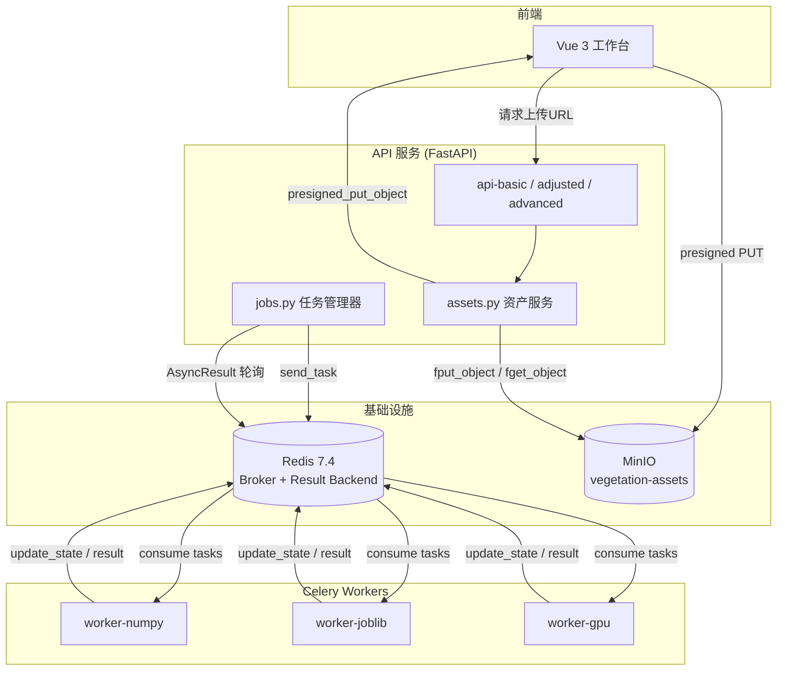
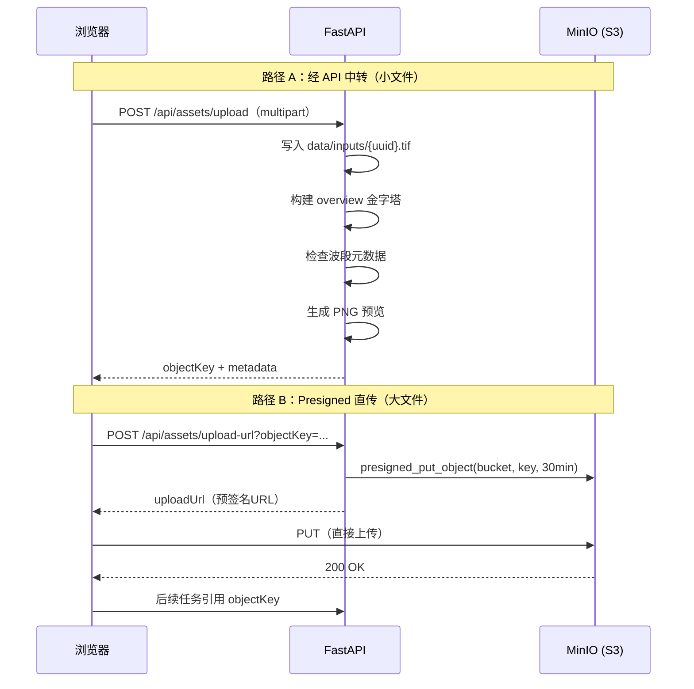
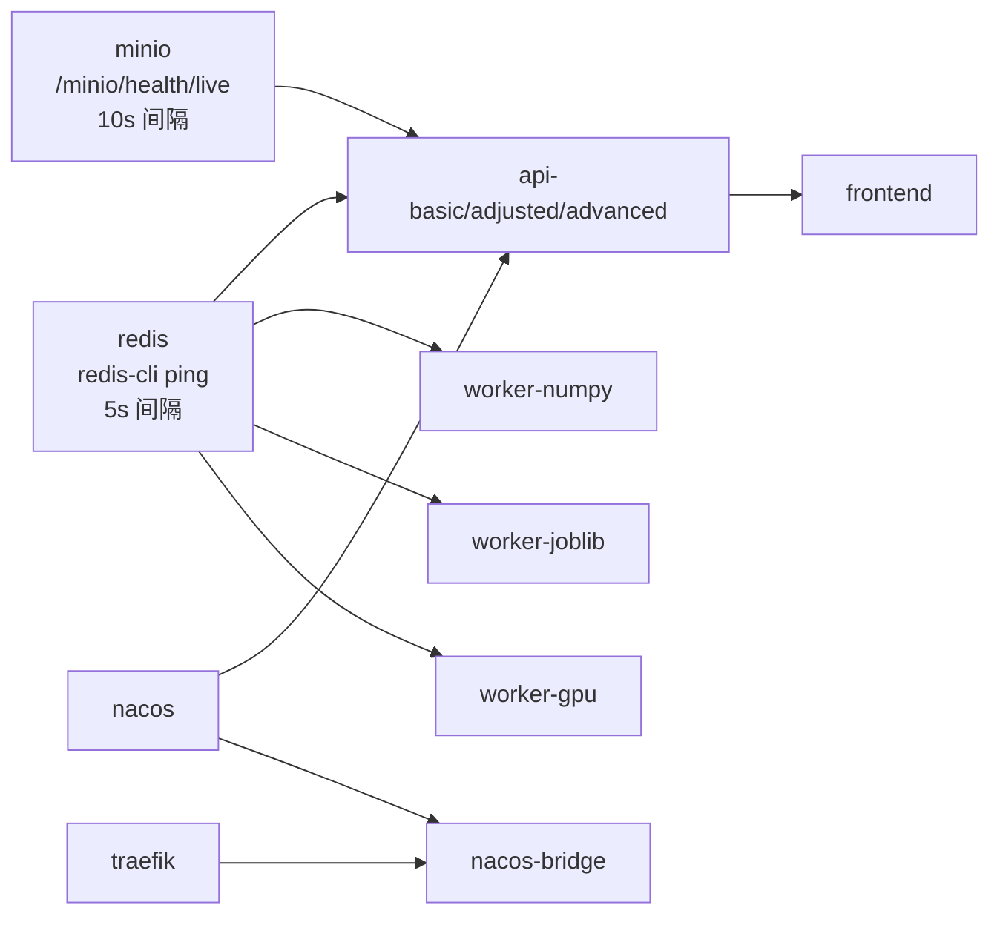

本文档聚焦平台两大外部基础设施组件：**MinIO 对象存储**负责遥感影像与派生产品的持久化分发，**Redis** 负责 Celery 任务队列的消息路由与结果暂存。两者共同构成[同步执行与 Celery 异步任务管道](17-tong-bu-zhi-xing-yu-celery-yi-bu-ren-wu-guan-dao)和前端资产上传流程的运行底座。

## 架构总览：存储与消息在系统中的位置

平台采用 **Redis 作为 Celery 消息代理**、**MinIO 作为对象存储**的双基础设施架构。下图展示了它们与 API 服务、Worker 和前端之间的数据流关系：



在这个架构中，**Redis 仅承担消息队列职责**——不作为通用缓存层使用。平台的瓦片缓存采用进程内 `lru_cache` 策略（见[GeoTIFF 动态瓦片叠加与图层控制](20-geotiff-dong-tai-wa-pian-die-jia-yu-tu-ceng-kong-zhi)），Agent 会话和知识库均持久化至 PostgreSQL（见[Agent 会话事件存储与结果解读](15-agent-hui-hua-shi-jian-cun-chu-yu-jie-guo-jie-du)）。

Sources: [compose.yml](compose.yml#L1-L192), [celery_app.py](backend/app/celery_app.py#L1-L36)

## Redis：Celery 消息代理与结果后端

### 容器定义与持久化策略

Redis 容器使用 **redis:7.4-alpine** 镜像，启用 AOF（Append-Only File）持久化确保任务队列状态在容器重启后不丢失。在 `compose.yml` 中的定义如下：

```yaml
redis:
  image: redis:7.4-alpine
  command: ["redis-server", "--appendonly", "yes"]
  healthcheck:
    test: ["CMD", "redis-cli", "ping"]
    interval: 5s
    timeout: 3s
    retries: 10
  volumes:
    - redis-data:/data
```

AOF 模式下 Redis 会将每个写命令追加到日志文件，相比 RDB 快照提供更精细的持久化粒度。**`redis-cli ping`** 健康检查每 5 秒执行一次，只有健康检查通过后 API 服务和 Worker 才会启动（通过 `depends_on: condition: service_healthy` 控制）。

Sources: [compose.yml](compose.yml#L146-L157)

### Celery Broker 配置

Celery 应用使用同一 Redis 实例同时作为 **消息代理（Broker）** 和 **结果后端（Backend）**，连接地址由环境变量 `VIP_REDIS_URL` 提供，Docker Compose 中默认为 `redis://redis:6379/0`：

```python
# celery_app.py
celery_app = Celery(
    "vegetation_jobs",
    broker=settings.redis_url,
    backend=settings.redis_url,
    include=["app.worker_tasks"],
)
```

在本地开发环境中，`Settings` 模型的默认值为 `redis://localhost:6379/0`。部署模式下，所有 API 服务和 Worker 共享 `x-api-environment` 锚点中的统一 Redis 地址，避免配置不一致。

Sources: [celery_app.py](backend/app/celery_app.py#L18-L24), [settings.py](backend/app/settings.py#L20), [compose.yml](compose.yml#L2-L11)

### 五级优先队列

平台为 Celery 设计了 **五级优先队列**，消息路由策略为 `priority`，不同优先级的任务由不同类型的 Worker 消费：

| 队列名 | 优先级 | 路由键 | 典型场景 | 消费 Worker |
|--------|--------|--------|----------|-------------|
| `urgent` | 1（最高） | `priority.1` | 用户主动取消前的紧急任务 | worker-joblib |
| `high` | 2 | `priority.2` | 交互式单指数快速提取 | worker-joblib |
| `normal` | 3（默认） | `priority.3` | 常规多指数批量计算 | worker-numpy / worker-joblib |
| `low` | 4 | `priority.4` | 后台预计算、概览生成 | worker-numpy |
| `batch` | 5（最低） | `priority.5` | 大面积多时相批量任务 | worker-numpy |

Worker 实例的队列分配在 `compose.yml` 中通过命令行参数显式绑定：

- **worker-numpy**：消费 `normal`、`low`、`batch` 三个队列，并发数为 1（适合小型同步任务）
- **worker-joblib**：消费 `urgent`、`high`、`normal` 三个队列，并发数为 2（适合中大型并行任务）
- **worker-gpu**：使用 `Dockerfile.gpu` 构建，保留 NVIDIA GPU 直通能力

优先级映射在 `JobManager._submit_celery` 中完成，将 1-5 的数字优先级映射到队列名：

```python
queues = {1: "urgent", 2: "high", 3: "normal", 4: "low", 5: "batch"}
async_result = celery_app.send_task(
    "app.worker_tasks.process_raster",
    args=[task_as_dict(task)],
    queue=queues[priority],
    priority=max(0, priority - 1),
)
```

Sources: [celery_app.py](backend/app/celery_app.py#L25-L36), [jobs.py](backend/app/services/jobs.py#L121-L136), [compose.yml](compose.yml#L76-L105)

### 进度上报与结果拉取

Worker 通过 `self.update_state(state="PROGRESS", meta={...})` 将进度写入 Redis 的结果后端，API 层通过 `celery_app.AsyncResult` 轮询读取：

```python
# worker_tasks.py — 进度上报
def progress(current: int, total: int, message: str) -> None:
    self.update_state(
        state="PROGRESS",
        meta={
            "progress": round(current / max(total, 1) * 100, 2),
            "message": message,
            "current": current,
            "total": total,
            "throughput": round(throughput, 4),
            "eta_seconds": ...,
        },
    )
```

```python
# jobs.py — 进度拉取
result = celery_app.AsyncResult(record.id)
if result.state == "PROGRESS" and isinstance(result.info, dict):
    record.progress = float(result.info.get("progress", record.progress))
    record.message = str(result.info.get("message", record.message))
```

这种模式实现了**生产者-消费者解耦**：API 层不需要与 Worker 直接通信，所有状态交换都通过 Redis 中介完成。

Sources: [worker_tasks.py](backend/app/worker_tasks.py#L24-L41), [jobs.py](backend/app/services/jobs.py#L155-L185)

### 开发与部署模式切换

平台通过 `VIP_CELERY_ALWAYS_EAGER` 环境变量控制任务执行模式：

| 模式 | 配置 | 行为 | 适用场景 |
|------|------|------|----------|
| **开发模式** | `CELERY_ALWAYS_EAGER=true`（默认） | 任务在 API 进程的线程池中同步执行，不依赖 Redis | 本地调试、单元测试 |
| **部署模式** | `CELERY_ALWAYS_EAGER=false` | 任务通过 Redis 分发到 Worker 容器 | Docker Compose 部署 |

`JobManager` 在 `submit` 方法中根据此标志选择执行路径：开发模式使用 `ThreadPoolExecutor`，部署模式调用 `celery_app.send_task`。任务取消同样区分模式——部署模式通过 `celery_app.control.revoke` 向 Worker 发送终止信号。

Sources: [settings.py](backend/app/settings.py#L22), [jobs.py](backend/app/services/jobs.py#L47-L55), [jobs.py](backend/app/services/jobs.py#L67-L73)

## MinIO：遥感资产对象存储

### 容器定义与访问控制

MinIO 容器使用 **minio/minio** 官方镜像，提供 S3 兼容 API（端口 9000）和管理控制台（端口 9001）：

```yaml
minio:
  image: minio/minio:RELEASE.2025-04-22T22-12-26Z
  command: server /data --console-address ":9001"
  environment:
    MINIO_ROOT_USER: vegetation
    MINIO_ROOT_PASSWORD: vegetation-secret
  healthcheck:
    test: ["CMD", "curl", "-f", "http://localhost:9000/minio/health/live"]
    interval: 10s
    timeout: 5s
    retries: 10
  volumes:
    - minio-data:/data
```

访问凭据通过 `VIP_MINIO_ACCESS_KEY` 和 `VIP_MINIO_SECRET_KEY` 环境变量注入 API 服务，默认桶名为 `vegetation-assets`。健康检查通过 HTTP 探活端点 `/minio/health/live` 完成。

Sources: [compose.yml](compose.yml#L159-L173), [settings.py](backend/app/settings.py#L25-L29)

### 条件启用机制

MinIO 通过 `VIP_MINIO_ENABLED` 标志**条件启用**。当该值为 `false`（本地开发默认值）时，资产操作回退到本地文件系统：

```python
# routes.py — capabilities 端点
"objectStorage": "minio",
```

```python
# assets.py — 上传产物
def upload_artifact(path: Path, object_key: str) -> str | None:
    if not settings.minio_enabled:
        return object_key  # 开发模式直接返回本地 key
    # ... MinIO 上传逻辑
```

测试夹具同样禁用 MinIO 以保证隔离性：

```python
# conftest.py
monkeypatch.setattr(settings, "minio_enabled", False)
```

| 模式 | `minio_enabled` | 资产存储位置 | 适用场景 |
|------|-----------------|-------------|----------|
| 开发模式 | `false`（默认） | `data/inputs/` 本地目录 | 本地开发、单元测试 |
| 部署模式 | `true` | MinIO `vegetation-assets` 桶 | Docker Compose 部署 |

Sources: [settings.py](backend/app/settings.py#L29), [assets.py](backend/app/services/assets.py#L285-L296), [conftest.py](backend/tests/conftest.py#L16-L20)

### 核心操作：三种资产访问模式

MinIO 在平台中承担三种资产访问职责，全部封装在 `app/services/assets.py` 中：

**模式一：预签名上传 URL（Presigned PUT）**

前端通过 `/api/assets/upload-url` 端点获取 30 分钟有效的预签名 URL，然后直接向 MinIO 上传文件，无需经过 API 服务中转：

```python
def create_upload_url(object_key: str) -> dict[str, str]:
    client = Minio(
        settings.minio_endpoint,
        access_key=settings.minio_access_key,
        secret_key=settings.minio_secret_key,
        secure=settings.minio_secure,
    )
    if not client.bucket_exists(settings.minio_bucket):
        client.make_bucket(settings.minio_bucket)
    url = client.presigned_put_object(
        settings.minio_bucket,
        object_key,
        expires=timedelta(minutes=30),
    )
    return {"objectKey": object_key, "uploadUrl": url}
```

**模式二：按需下载（fget_object）**

当任务需要处理存储在 MinIO 中的影像时，`resolve_source` 将对象键解析为本地文件路径——先检查本地缓存，未命中时从 MinIO 下载：

```python
def resolve_source(object_key: str | None, local_path: str | None) -> Path:
    if local_path:
        return Path(local_path).resolve()  # 本地路径直接使用
    target = (settings.data_dir / "inputs" / Path(object_key).name).resolve()
    client = Minio(...)
    client.fget_object(settings.minio_bucket, object_key, str(target))
    return target
```

**模式三：产物上传（fput_object）**

计算完成后，`upload_artifact` 将派生的 GeoTIFF、PNG 预览等产品上传到 MinIO，供前端瓦片服务和结果下载使用：

```python
def upload_artifact(path: Path, object_key: str) -> str | None:
    if not settings.minio_enabled:
        return object_key
    client = Minio(...)
    if not client.bucket_exists(settings.minio_bucket):
        client.make_bucket(settings.minio_bucket)
    client.fput_object(settings.minio_bucket, object_key, str(path))
    return object_key
```

Sources: [assets.py](backend/app/services/assets.py#L235-L260), [assets.py](backend/app/services/assets.py#L209-L233), [assets.py](backend/app/services/assets.py#L285-L296), [routes.py](backend/app/api/routes.py#L207-L213)

### 上传流水线：浏览器到存储的完整路径

平台支持两种影像上传路径。下面的流程图展示了从用户操作到持久化存储的完整链路：



路径 B 的优势在于大文件不经过 API 服务，减轻内存压力。任务执行时 `resolve_source` 会自动从 MinIO 下载到本地 `data/inputs/` 目录。

Sources: [routes.py](backend/app/api/routes.py#L207-L213), [assets.py](backend/app/services/assets.py#L265-L283)

## 环境变量配置参考

下表汇总了所有与 MinIO 和 Redis 相关的环境变量，均以 `VIP_` 为前缀，定义在 `app/settings.py` 的 `Settings` 模型中：

| 环境变量 | 默认值 | 说明 | 使用组件 |
|----------|--------|------|----------|
| `VIP_REDIS_URL` | `redis://localhost:6379/0` | Redis 连接地址（含数据库号） | Celery Broker + Backend |
| `VIP_CELERY_ALWAYS_EAGER` | `true` | `true`=同步模式，`false`=异步模式 | Celery、JobManager |
| `VIP_MINIO_ENDPOINT` | `localhost:9000` | MinIO API 地址 | 资产服务 |
| `VIP_MINIO_ACCESS_KEY` | `vegetation` | MinIO 访问密钥 | 资产服务 |
| `VIP_MINIO_SECRET_KEY` | `vegetation-secret` | MinIO 密钥 | 资产服务 |
| `VIP_MINIO_SECURE` | `false` | 是否启用 TLS | 资产服务 |
| `VIP_MINIO_BUCKET` | `vegetation-assets` | 默认存储桶名 | 资产服务 |
| `VIP_MINIO_ENABLED` | `false` | 是否启用 MinIO（否则回退本地） | 资产服务、路由 |

Docker Compose 部署模式下，`x-api-environment` 锚点统一覆盖了关键变量，确保所有 API 服务和 Worker 使用相同的基础设施端点。

Sources: [settings.py](backend/app/settings.py#L15-L31), [compose.yml](compose.yml#L2-L11)

## 数据卷与持久化

平台使用 Docker 命名卷管理基础设施的持久化数据：

| 卷名 | 服务 | 持久化内容 | 备份优先级 |
|------|------|-----------|-----------|
| `redis-data` | Redis | AOF 日志（任务队列状态、结果缓存） | 中（丢失后进行中的任务需重新提交） |
| `minio-data` | MinIO | 对象存储（输入影像、输出产物、预览图） | 高（丢失将导致资产不可恢复） |
| `vegetation-data` | API + Worker | 本地 `data/` 目录（缓存的输入、中间产物） | 低（可从 MinIO 重建） |

`vegetation-data` 卷挂载到所有 API 服务和 Worker 的 `/app/data` 目录，确保 Worker 产生的文件可被 API 服务的 `/artifacts` 静态文件端点直接访问。

Sources: [compose.yml](compose.yml#L175-L192)

## 健康检查与启动依赖链

两个基础设施服务都配置了健康检查，形成严格的启动依赖链：



- **Redis 健康检查**：`redis-cli ping`，间隔 5 秒，超时 3 秒，最多重试 10 次
- **MinIO 健康检查**：`curl -f http://localhost:9000/minio/health/live`，间隔 10 秒，超时 5 秒，最多重试 10 次

所有 API 服务和 Worker 都通过 `depends_on: condition: service_healthy` 确保 Redis 和 MinIO 就绪后才启动。这种设计避免了启动期间因连接拒绝导致的级联失败。

Sources: [compose.yml](compose.yml#L16-L21), [compose.yml](compose.yml#L146-L157), [compose.yml](compose.yml#L159-L173)

## 测试中的隔离策略

单元测试通过 `conftest.py` 中的 `isolate_external_services` 夹具自动禁用外部依赖，确保测试不依赖真实的 Redis 或 MinIO 实例：

```python
@pytest.fixture(autouse=True)
def isolate_external_services(monkeypatch: pytest.MonkeyPatch) -> None:
    monkeypatch.setattr(settings, "database_url", None)
    monkeypatch.setattr(settings, "minio_enabled", False)
    monkeypatch.setattr(settings, "openai_api_key", None)
    monkeypatch.setattr(settings, "openai_base_url", None)
```

在此配置下，`minio_enabled=False` 使 `upload_artifact` 跳过 MinIO 上传直接返回对象键，`celery_always_eager=True` 使任务在进程内线程池同步执行不经过 Redis。这保证了测试的确定性和可重复性。

Sources: [conftest.py](backend/tests/conftest.py#L16-L20)

## 阅读建议

本文档聚焦 MinIO 和 Redis 的基础设施层面。如需进一步了解依赖这些组件的上层功能，建议按以下顺序阅读：

- **任务调度与执行**：[同步执行与 Celery 异步任务管道](17-tong-bu-zhi-xing-yu-celery-yi-bu-ren-wu-guan-dao) → [任务优先级、进度查询与取消](18-ren-wu-you-xian-ji-jin-du-cha-xun-yu-qu-xiao)
- **遥感资产上传**：[遥感影像上传、波段映射与元数据推断](21-yao-gan-ying-xiang-shang-chuan-bo-duan-ying-she-yu-yuan-shu-ju-tui-duan)
- **容器编排全景**：[Docker Compose 服务编排全景](23-docker-compose-fu-wu-bian-pai-quan-jing)
- **测试覆盖策略**：[后端测试策略与 pytest 覆盖范围](26-hou-duan-ce-shi-ce-lue-yu-pytest-fu-gai-fan-wei)